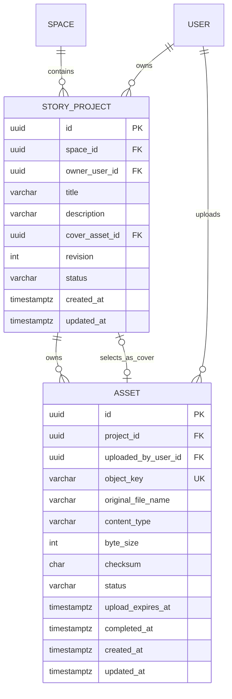

# 故事基础信息页面与数据库设计

## 状态

- 日期：2026-08-20
- 状态：设计建议
- 读者：负责 Story Web、Server、Prisma 迁移和对象存储接入的工程师
- 阅读后的行动：按本文为“故事基础信息”页面接入读取、保存和封面上传，不再新增重复的基础信息聚合
- 相关设计：
  - [故事世界观持久化与数据库表设计](2026-08-20-story-worldview-persistence-design.md)
  - [C 端用户体系数据库表设计](docs/architecture/2026-08-13-c-end-user-database-schema-design.md)

## 1. 设计结论

“故事基础信息”是故事项目自身的元数据编辑页，不是一个独立的版本化故事成果。首期数据库设计应遵守以下边界：

1. 故事名继续使用 `story_projects.title`，不创建第二个名称字段。
2. 故事描述新增为 `story_projects.description`。
3. 封面保存为项目对已完成图片资产的引用，不保存图片二进制、Base64 或临时访问 URL。
4. 页面三个字段使用项目现有的 `revision` 做乐观并发控制，并在一次事务中保存。
5. 不创建 `story_project_basic_infos`，也不创建 `basic` 类型的 `StoryArtifact`。
6. 资产模型必须从当前的“仅团队可用”边界迁移为“归属于故事项目”，个人空间项目和团队空间项目才能共用同一套封面流程。

首期只需要修改两张现有表：

- `story_projects`：增加故事描述和当前封面资产引用。
- `assets`：调整项目归属，使个人项目也能上传资产，并为封面引用提供同项目约束。

## 2. 页面完整审查

### 2.1 页面位置和导航关系

页面路由形态为：

```text
/stories/{projectId}/basic
```

它处在故事项目顶部导航的第一个位置，后续依次是世界观、角色资产、大纲和故事正文。页面承担项目创作的起点信息，而不是正文成果编辑。

项目页公共工具栏还提供“保存”和“导出”两个操作，但当前均处于禁用状态。

### 2.2 页面标题区

页面顶部包含：

| 内容   | 当前文案                                           | 业务含义                         |
| ------ | -------------------------------------------------- | -------------------------------- |
| Kicker | 项目起点 / BASIC INFO                              | 表明这是项目级元数据             |
| 主标题 | 故事基础信息                                       | 当前功能名称                     |
| 引导语 | 先确认故事的名字和表达，再继续组织后续的创作资产。 | 基础信息会被其他创作模块共同引用 |

标题区本身不产生独立数据。

### 2.3 故事名

页面字段：

| 项目       | 当前表现                       |
| ---------- | ------------------------------ |
| 标签       | 故事名                         |
| 控件       | 单行文本输入框                 |
| 占位文案   | 给这个故事一个名字             |
| 当前初始值 | 空字符串                       |
| 当前校验   | 无客户端长度提示或 `maxlength` |
| 当前保存   | 无                             |

故事名与已经存在的故事项目标题是同一个事实，应直接映射到 `story_projects.title`。如果另建 `story_name`，项目列表标题、项目页标题和基础信息标题将形成多个事实源。

建议规则：

- 去除首尾空白。
- 长度为 1～200 个字符。
- 允许中文、英文、数字和常用符号。
- 不要求全局唯一，也不要求同一空间唯一。

### 2.4 故事描述

页面字段：

| 项目       | 当前表现                       |
| ---------- | ------------------------------ |
| 标签       | 故事描述                       |
| 控件       | 多行纯文本输入框               |
| 默认高度   | 7 行，最小视觉高度约 170px     |
| 占位文案   | 用几句话描述这个故事想讲什么。 |
| 当前初始值 | 空字符串                       |
| 当前校验   | 无长度限制                     |
| 当前保存   | 无                             |

这个字段表达项目级简介，而不是世界观设定、故事正文或完整大纲。它应作为项目元数据供以下场景复用：

- 项目详情和项目卡片摘要。
- Agent 上下文中的项目级简述。
- 搜索结果摘要。
- 后续作品发布信息的初始候选内容。

建议首期保存纯文本，不保存 HTML 或富文本 JSON。页面当前只提供普通 `textarea`，将其升级为富文本没有现有需求依据。

建议规则：

- 允许空字符串，表示尚未填写。
- 去除首尾空白，保留正文内部换行。
- 最长 2,000 个字符。
- 数据库使用非空字段和空字符串默认值，避免前后端在 `null` 与空文本之间反复转换。

### 2.5 故事封面

页面右侧是 3:4 比例的封面卡片，包含加号、“故事封面”和“上传封面图片”文案。当前仅为占位展示，不能选择文件，也没有上传进度、失败重试、预览、更换或移除操作。

封面实际包含两个不同事实：

1. 图片资产：文件在对象存储中的身份、类型、大小、校验值和上传状态。
2. 封面选择：故事项目当前选择哪一个已完成图片资产作为封面。

这两个事实不能合并成 `cover_url` 字符串。对象访问地址可能是短期签名 URL，也可能因 CDN 域名、缩略图规格或权限策略变化而变化。数据库只保存资产 ID，读取接口再生成可用的展示地址。

当前资产上传只覆盖团队项目；个人项目没有对应的资产路由和数据归属能力。实现基础信息封面之前必须补齐这一边界，否则同一个页面会在团队项目可用、个人项目不可用。

### 2.6 响应式布局

- 桌面宽度下，表单在左，封面卡片在右。
- 中等宽度下，封面列缩窄。
- 窄屏下变为单列，封面移动到表单下方。
- 封面保持 3:4 视觉比例，但这只是展示比例，当前还没有裁剪数据模型。

首期不应因为视觉比例增加裁剪表。只有产品真正提供移动、缩放和裁剪框时，才需要保存裁剪参数或生成独立封面变体。

### 2.7 当前数据流缺口

当前页面是纯前端原型，存在以下缺口：

1. 故事名和故事描述只存在组件本地内存中。
2. 页面重新挂载后，两个字段都会恢复为空。
3. 路由中的 `projectId` 没有用于读取基础信息。
4. 已存在的项目标题没有传入表单。
5. Server 项目输出没有故事描述和封面资产。
6. Web 类型虽然预留了 `coverUrl`，但 Server 项目输出和项目表没有对应持久化来源。
7. 公共“保存”按钮被禁用，页面自身也没有提交处理。
8. 页面没有加载、只读、脏数据、保存中、已保存、并发冲突或保存失败状态。
9. 页面没有上传、上传完成、上传失败、更换封面或移除封面的状态。

因此，不能从当前输入框存在推断数据库已经支持这些字段。

### 2.8 页面定义与实际 UI 的差异

工作台对基础信息的内部描述还提到“一句话概念”“目标读者”和“核心表达”，但当前实际页面没有这些独立字段，也没有对应交互。

首期数据库不能据此直接增加 `logline`、`target_audience`、`theme` 等猜测字段。当前的“故事描述”只定义为短项目简介。后续如果产品确认需要一句话概念、目标读者、题材或主题，应把它们作为语义明确的独立字段或创作简报模型，而不是继续把所有内容塞进 `description`。

## 3. 领域边界

### 3.1 项目基础信息

项目基础信息是故事项目的身份和摘要，包括故事名、故事描述和当前封面。它与项目一起创建、授权、归档和查询，没有独立生命周期。

### 3.2 故事成果模块

世界观、角色资产、大纲和故事正文是可独立编辑、生成、确认、回退的故事成果，因此继续使用 `StoryArtifact` 和不可变版本。

基础信息不进入成果版本体系，原因是：

- 项目列表必须直接读取标题和封面，不能为每个项目再查一个版本化 JSON。
- 项目标题已经是 `StoryProject` 的领域属性。
- 封面需要关系完整性，资产 ID 不适合藏在版本 JSON 中。
- 基础信息更新只需要项目修订号和审计，不需要草稿、确认、丢弃状态机。

### 3.3 图片资产

图片资产是故事项目拥有的上传文件记录。对象存储保存文件本体，PostgreSQL 保存权属、对象键、文件元数据和状态。

资产不是封面。一个资产只有被项目选中后才成为当前封面；被替换的旧封面仍可以作为普通项目资产存在。

### 3.4 封面访问地址

封面访问地址是读取时生成的投影，不是持久化事实。API 可以返回 `coverUrl` 作为便利字段，但它必须由 `coverAssetId` 和对象存储读取策略产生。

## 4. 数据关系



`STORY_PROJECT o|--o| ASSET` 表示一个项目最多选择一个当前封面；该资产仍然通过 `ASSET.project_id` 归属于同一个项目。

## 5. `story_projects` 表设计

### 5.1 推荐字段

| 字段                 | PostgreSQL 类型  | 是否为空       | 默认值                         | 说明                                         |
| -------------------- | ---------------- | -------------- | ------------------------------ | -------------------------------------------- |
| `id`                 | `UUID`           | 否             | `gen_random_uuid()` 或应用生成 | 项目主键                                     |
| `tenant_id`          | `UUID`           | 按当前过渡模型 | `NULL` 或当前团队              | 现有兼容范围字段，目标归属由 `space_id` 表示 |
| `space_id`           | `UUID`           | 否             | 无                             | 项目当前所属个人或团队空间                   |
| `created_by_user_id` | `UUID`           | 否             | 无                             | 项目创建者，历史事实                         |
| `owner_user_id`      | `UUID`           | 否             | 无                             | 当前项目所有者                               |
| `title`              | `VARCHAR(200)`   | 否             | 无                             | 故事名，复用现有字段                         |
| `description`        | `VARCHAR(2000)`  | 否             | `''`                           | 故事描述，新增                               |
| `cover_asset_id`     | `UUID`           | 是             | `NULL`                         | 当前封面图片资产，新增                       |
| `creation_mode`      | `VARCHAR(16)`    | 否             | `'standard'`                   | 标准或沉浸式创作                             |
| `visibility`         | `VARCHAR(16)`    | 按当前过渡模型 | 当前规则                       | 现有兼容字段，不承载基础信息语义             |
| `status`             | `VARCHAR(16)`    | 否             | `'active'`                     | 项目生命周期                                 |
| `revision`           | `INTEGER`        | 否             | `1`                            | 项目元数据乐观并发号                         |
| `created_at`         | `TIMESTAMPTZ(3)` | 否             | 数据库时间                     | 创建时间                                     |
| `updated_at`         | `TIMESTAMPTZ(3)` | 否             | 数据库时间                     | 最后业务更新时间                             |

基础信息需求真正新增的只有 `description` 和 `cover_asset_id`。其余字段已经属于故事项目。

### 5.2 字段约束

建议数据库约束：

```sql
CHECK (char_length(title) BETWEEN 1 AND 200)
CHECK (title = btrim(title))
CHECK (char_length(description) <= 2000)
CHECK (revision >= 1)
```

`description` 可以包含换行，数据库只限制总字符数，不应对内部空白做破坏性压缩。

### 5.3 为什么不用 JSONB

标题、描述和封面都是稳定、可查询、需要校验的项目字段。将它们放入 `basic_info JSONB` 会带来以下问题：

- 标题与现有 `title` 重复。
- 封面资产无法获得清晰外键。
- 长度约束和数据迁移更复杂。
- 项目列表查询需要重复解析 JSON。
- 字段变化难以进入类型、审计和 API 契约。

因此首期应使用普通列。

## 6. `assets` 表设计

### 6.1 目标字段

| 字段                  | PostgreSQL 类型  | 是否为空 | 说明                                              |
| --------------------- | ---------------- | -------- | ------------------------------------------------- |
| `id`                  | `UUID`           | 否       | 资产主键                                          |
| `project_id`          | `UUID`           | 否       | 资产所属故事项目                                  |
| `uploaded_by_user_id` | `UUID`           | 否       | 上传用户                                          |
| `object_key`          | `VARCHAR(512)`   | 否       | 对象存储键，全局唯一                              |
| `original_file_name`  | `VARCHAR(255)`   | 否       | 原始文件名                                        |
| `content_type`        | `VARCHAR(128)`   | 否       | 首期允许 JPEG、PNG、WebP                          |
| `byte_size`           | `INTEGER`        | 否       | 文件字节数，当前上限 20 MiB                       |
| `checksum`            | `CHAR(64)`       | 是       | SHA-256 十六进制摘要                              |
| `status`              | `VARCHAR(24)`    | 否       | `pending_upload`、`uploaded`、`failed`、`deleted` |
| `upload_expires_at`   | `TIMESTAMPTZ(3)` | 否       | 预签名上传有效期                                  |
| `completed_at`        | `TIMESTAMPTZ(3)` | 是       | 上传确认时间                                      |
| `created_at`          | `TIMESTAMPTZ(3)` | 否       | 创建时间                                          |
| `updated_at`          | `TIMESTAMPTZ(3)` | 否       | 状态更新时间                                      |

这些字段基本复用现有资产模型。关键调整是：目标模型让资产只通过 `project_id` 继承项目的空间归属，不再要求每条资产拥有一个非空 `tenant_id`。

这与项目目标模型一致：项目子表通过父项目决定授权和空间，不自己成为第二个归属事实源。

### 6.2 个人空间兼容

当前资产表要求非空团队 `tenant_id`，并要求上传者存在团队成员关系，因此无法表示个人空间项目资产。

目标迁移应：

1. 让资产通过 `project_id` 外键归属项目。
2. 授权时先加载项目及其 `space_id`，再按个人空间或团队空间规则校验。
3. 提供与团队上传流程等价的个人项目资产 API。
4. 新对象键不再把团队 ID 当作唯一业务归属，可以使用：

```text
story-projects/{projectId}/assets/{assetId}/original
```

项目以后移动空间时，不需要搬迁对象存储文件。

现有对象键不必批量重写；数据库中的 `object_key` 是文件的实际位置，旧键可以继续读取。

### 6.3 图片尺寸

当前页面没有裁剪和尺寸展示需求，所以首期不需要新增图片详情表。Server 仍应在上传完成时读取文件签名并验证文件确实是受支持的图片，限制解码尺寸，不能只信任客户端声明或对象存储返回的 MIME 类型，以免伪装文件和异常大尺寸图片进入封面链路。

如果后续需要服务端缩略图、比例校验或裁剪，再增加以下派生字段或独立图片详情表：

- `width_px`
- `height_px`
- `dominant_color`
- `blur_hash`

这些字段不影响首期封面选择关系。

## 7. 外键和完整性约束

### 7.1 资产归属项目

```sql
FOREIGN KEY (project_id)
REFERENCES story_projects(id)
ON DELETE RESTRICT;
```

硬删除项目时应先通过可重试清理流程删除对象存储文件和资产记录，不使用数据库级联直接遗留孤儿对象。

### 7.2 封面必须属于当前项目

仅设置下面这个普通外键是不够的：

```text
story_projects.cover_asset_id → assets.id
```

它只能证明资产存在，不能防止项目 A 引用项目 B 的资产。

推荐在 `assets` 上增加：

```sql
UNIQUE (project_id, id)
```

再增加复合外键：

```sql
FOREIGN KEY (id, cover_asset_id)
REFERENCES assets(project_id, id)
ON DELETE RESTRICT;
```

由于 `cover_asset_id` 可空，没有封面的项目不会触发该外键；一旦非空，数据库会保证封面资产属于同一个项目。

如果 ORM 无法完整表达这个循环复合关系，应在受审查的 SQL migration 中建立约束，不能退化为只靠客户端校验。

### 7.3 封面资产状态

“只能选择 `status = uploaded` 的图片”涉及另一行的状态，普通 `CHECK` 无法跨表验证。保存事务必须：

1. 锁定项目。
2. 按 `project_id + asset_id` 读取资产。
3. 校验 `status = uploaded`。
4. 校验 `content_type` 是支持的图片类型。
5. 更新项目并写审计。

删除资产时也必须检查它是否仍被项目引用为封面。数据库外键负责最终兜底，应用返回可理解的“请先移除当前封面”错误。

## 8. 索引设计

### 8.1 项目表

保留现有按空间和状态列出项目的索引。为封面引用增加：

```sql
CREATE INDEX story_projects_cover_asset_id_idx
ON story_projects (cover_asset_id)
WHERE cover_asset_id IS NOT NULL;
```

当前页面按项目主键读取，不需要为 `description` 单独建 B-tree 索引。

如果后续支持标题和描述全文搜索，再建立专用搜索投影或 PostgreSQL 全文索引，不在首期提前加入模糊索引。

### 8.2 资产表

建议保留或调整为：

```sql
UNIQUE (object_key)
UNIQUE (project_id, id)
INDEX (project_id, status, created_at DESC, id DESC)
```

`assets.id` 已是主键，但 `(project_id, id)` 唯一键用于同项目封面复合外键。

## 9. 保存事务与并发

### 9.1 保存请求

项目更新接口应支持：

```json
{
  "title": "雾城来信",
  "description": "一名失忆调查员在被永久浓雾覆盖的城市寻找自己的过去。",
  "coverAssetId": "5f9c2ee6-d7b9-4f64-b4f4-e54705039284",
  "expectedRevision": 7
}
```

字段语义：

- 字段缺失：保持原值。
- `description: ""`：明确清空描述。
- `coverAssetId: null`：明确移除封面。
- `expectedRevision`：必须等于当前项目修订号。

### 9.2 原子事务

```text
开始事务
  → 按授权范围锁定 StoryProject
  → 校验项目处于 active 且当前用户可编辑
  → 校验 expectedRevision
  → 规范化并校验 title、description
  → coverAssetId 非空时校验资产属于本项目且已经 uploaded
  → 更新 title、description、cover_asset_id
  → revision + 1，更新 updated_at
  → 写项目审计记录
提交事务
```

如果三个字段都没有变化，应返回当前项目，不递增 `revision`，也不产生无意义审计记录。

### 9.3 并发冲突

两名协作者同时编辑时，后提交但使用旧修订号的请求返回 `409 Conflict`。响应应包含稳定错误码；客户端重新读取最新项目，并让用户选择保留本地内容还是加载服务器版本。

不应使用“最后写入覆盖一切”，否则标题、描述和封面可能在无提示情况下被其他协作者覆盖。

### 9.4 审计内容

基础信息保存属于项目元数据更新，应继续写项目审计。建议审计保存：

- 变更字段集合。
- 变更前后标题。
- 描述是否变化，可选保存长度或内容摘要。
- 变更前后封面资产 ID。
- 变更前后项目修订号。

描述可能包含未发布创作内容，不建议把完整长文本重复复制到审计摘要。

## 10. 封面上传流程

封面上传和项目保存是两个阶段，避免把大文件穿过业务 Server：

```text
选择图片
  → 请求项目资产预签名上传地址
  → 浏览器直传对象存储
  → 调用资产上传完成接口
  → Server 校验对象大小、类型和存在性
  → 资产状态变为 uploaded
  → PATCH 项目，把该 assetId 设为 coverAssetId
```

失败处理：

- 预签名地址过期：资产标记失败，重新创建上传。
- 对象不存在或大小不匹配：不得设为封面。
- 项目保存并发冲突：上传资产可以保留，用户重新加载后再次选择，不重复上传。
- 项目封面替换：旧资产不自动删除，避免它正在其他创作位置被使用。
- 移除封面：只清空项目引用，不自动删除资产。

## 11. API 输出建议

项目读取输出建议增加：

```json
{
  "project": {
    "id": "15e6dd3a-60c0-42af-8d4d-acda08362e63",
    "title": "雾城来信",
    "description": "一名调查员在雾城寻找自己的过去。",
    "coverAssetId": "5f9c2ee6-d7b9-4f64-b4f4-e54705039284",
    "coverUrl": "https://example.invalid/signed-or-cdn-url",
    "revision": 8,
    "canEdit": true
  }
}
```

其中：

- `coverAssetId` 是稳定业务引用。
- `coverUrl` 是可空读取投影，不进入数据库。
- 没有封面时两个字段均为 `null`。
- 只读用户仍能读取数据，但表单和上传入口必须禁用。

团队项目和个人项目使用相同响应结构。路径可以分别保持团队作用域和当前用户作用域，但内部应用用例应共用同一套领域校验。

## 12. 页面状态设计

页面接入数据后至少需要以下状态：

| 状态          | 页面行为                                             |
| ------------- | ---------------------------------------------------- |
| `loading`     | 显示骨架或禁用表单，避免空值闪烁                     |
| `ready-clean` | 展示服务器数据，保存按钮禁用                         |
| `ready-dirty` | 本地值已变化，允许保存                               |
| `saving`      | 禁止重复提交，显示同步中                             |
| `saved`       | 使用响应中的最新数据和 `revision` 重置表单基线       |
| `read-only`   | 展示内容，禁用编辑和上传                             |
| `conflict`    | 提示服务器内容已变化，提供重新加载或保留本地草稿选择 |
| `error`       | 保留本地输入，允许重试                               |
| `uploading`   | 展示封面上传进度，不能把未完成资产设为封面           |

表单初始值必须来自项目读取结果，不能在路由切换时重新初始化为空字符串。

## 13. 数据迁移顺序

### 阶段 1：项目文本字段

1. 为 `story_projects` 增加 `description VARCHAR(2000) NOT NULL DEFAULT ''`。
2. 扩展领域快照、Repository、DTO 和项目输出。
3. 让项目更新事务同时支持标题和描述。
4. 接入页面读取和文本保存。

这一阶段可以先上线，不依赖封面上传改造。

### 阶段 2：资产归属迁移

1. 让资产以 `project_id` 作为业务归属外键。
2. 将旧团队资产回填并验证其项目关系。
3. 调整 Repository 和授权流程，先通过父项目确定空间。
4. 增加个人项目资产路由。
5. 新对象键停止绑定团队路径，旧对象键保持可读。
6. 数据和调用方全部切换后，再移除过渡性的资产 `tenant_id` 依赖。

### 阶段 3：封面引用

1. 为 `story_projects` 增加可空 `cover_asset_id`。
2. 在 `assets` 增加 `(project_id, id)` 唯一键。
3. 增加封面同项目复合外键和部分索引。
4. 扩展项目读取和更新接口。
5. 接入上传、完成、选择、更换和移除流程。

### 阶段 4：清理兼容状态

1. 项目列表和项目详情统一从 Server 投影封面地址。
2. 删除只靠 Web 假数据传递 `coverUrl` 的兼容逻辑。
3. 补充对象清理和失效资产回收任务。

## 14. 测试与验收

### 14.1 数据库与 Repository

- 空描述可以保存，超过 2,000 字符被拒绝。
- 空标题和超过 200 字符的标题被拒绝。
- 项目不能引用其他项目的资产作为封面。
- 项目不能引用不存在或未完成上传的资产作为封面。
- 被引用为封面的资产不能直接删除。
- 清空封面后可以删除原资产。
- 个人项目和团队项目都可以拥有资产。
- 旧团队资产迁移后仍可读取。

### 14.2 应用与 HTTP

- 可编辑用户可以一次更新标题、描述和封面。
- 只读用户不能更新或上传。
- 归档项目不能更新基础信息。
- 旧 `expectedRevision` 返回并发冲突。
- 无变化保存不递增修订号。
- 更新与审计在同一事务提交。
- `coverUrl` 由资产生成，数据库没有 URL 字段。
- 团队作用域和个人作用域不会串读项目或资产。

### 14.3 Web 页面

- 进入指定项目 `/basic` 后展示真实标题、描述和封面。
- 路由切换和刷新不会把字段重置为空。
- 修改后才启用保存。
- 保存成功后使用新修订号继续编辑。
- 保存失败保留用户输入。
- 并发冲突不会静默覆盖服务器内容。
- 上传中、失败和成功状态清晰。
- 更换或移除封面不会误删资产。
- 无编辑权限时页面可读但不可写。
- 桌面和窄屏布局都能完整操作。

## 15. 首期明确不做

- 不创建单独的基础信息表。
- 不为基础信息创建 `StoryArtifact` 或版本状态机。
- 不把标题、描述和封面塞进 JSONB。
- 不把图片二进制、Base64 或临时 URL 写入 PostgreSQL。
- 不因为 3:4 占位视觉就提前设计裁剪坐标。
- 不在替换封面时自动删除旧资产。
- 不允许个人项目和团队项目使用两套不同的封面数据模型。

## 16. 实施后的最终数据流

```text
StoryProject
  ├── title                 → 故事名
  ├── description           → 故事描述
  ├── cover_asset_id ───────┐
  └── revision              │
                            ▼
Asset
  ├── project_id            → 保证属于当前故事项目
  ├── object_key            → 定位对象存储文件
  ├── content_type          → 图片类型
  ├── byte_size/checksum    → 完整性
  └── status                → 只有 uploaded 可成为封面

读取接口
  └── cover_asset_id + object_key → 生成 coverUrl → Web 展示
```

这个设计保持项目身份只有一个事实源，封面拥有可靠资产边界，也能直接兼容个人空间、团队空间、项目移动和后续对象存储策略变化。

## 17. 故事标签与时代约束（已落地）

基础信息仍然直接存放在 `story_projects`，新增以下字段：

| 字段 | PostgreSQL 类型 | 约束 | 用途 |
| --- | --- | --- | --- |
| `description` | `VARCHAR(2000)` | 非空，默认空字符串 | 故事描述，也是 AI 总结的输入 |
| `era` | `VARCHAR(16)` | 非空，默认 `现代`，只能为 `现代` 或 `古代` | 必选的时代标签 |
| `tags` | `TEXT[]` | 非空，默认空数组，最多 16 项 | AI 总结或用户手动维护的内容标签 |

时代不作为普通可删除标签处理。Web 端只提供“现代 / 古代”切换；Server Domain、DTO 和数据库约束同时拒绝其他值，遗漏时代字段时沿用原值，因此不会出现没有时代标签的项目。

### 17.1 接口

- `PATCH /v1/me/story-projects/:projectId` 和团队同路径接口支持 `description`、`era`、`tags`，继续使用 `expectedRevision` 做乐观并发控制。
- `POST /v1/me/story-projects/:projectId/tags/generate`（团队项目对应 `/v1/teams/:teamId/story-projects/:projectId/tags/generate`）由 Agent 根据标题和描述返回 `{ era, tags }`，并在同一修订事务中保存。
- Agent 输出必须是 JSON；`era` 只能是现代或古代，内容标签会去重并限制为最多 16 项。

### 17.2 Web 交互

- `/stories/:projectId/basic` 首次进入从 Server 加载标题、描述、时代、标签和修订号。
- 用户可添加、删除内容标签并切换时代；时代没有删除按钮。
- “AI 总结标签”会将当前标题和描述提交给 Agent，并回填时代与内容标签。
- 保存成功后刷新本地修订号，发生并发冲突时保留当前编辑内容并提示重新加载。
