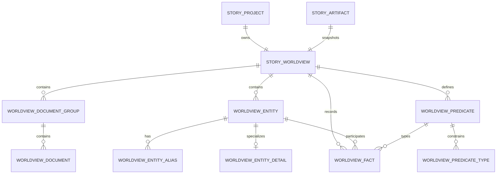

# 故事世界观持久化与数据库表设计

## 状态

- 日期：2026-08-20
- 状态：待实现前审阅
- 读者：负责 Story Web、Server、Prisma/PostgreSQL 和 Agent/RAG 接入的工程师
- 阅读后行动：能够据此拆分 Prisma 模型、数据库迁移、Server API、前端状态接入和验证测试

关联设计：

- [世界构成事实关系图编辑器](docs/superpowers/specs/2026-08-19-story-worldview-fact-graph-design.md)
- [世界构成结构化编辑器](docs/superpowers/specs/2026-08-18-story-worldview-structured-editor-design.md)
- [故事系统 MVP 设计](docs/superpowers/specs/2026-08-10-story-system-design.md)

## 1. 设计结论

世界观不按“设定文档”和“世界构成”两个页面页签各保存一份大 JSON，也不把前端原型的通用 `nodes + statements` 结构原样复制成弱约束三元组表。

推荐采用以下边界：

1. `StoryWorldview` 是一个故事项目内唯一的世界观实时编辑聚合。
2. 设定文档使用分组表和文档表保存。
3. 世界构成使用实体、实体类型详情、关系类型、关系类型约束和事实表保存。
4. 事实关系清单是正式关系的唯一写入入口；关系图只是事实表的读取投影。
5. Ontology 是关系类型及其约束，不直接生成事实。
6. 当前规范化表保存实时权威状态，现有 `StoryArtifactVersion` 保存不可变完整 JSON 快照。
7. UI 选择、目录折叠、当前筛选和自动图布局不属于核心业务数据，首期不落库。

这套设计保留前端统一知识图的读取模型，同时使用关系数据库能够可靠表达的外键、唯一约束、索引和事务边界。

## 2. 当前页面审查

### 2.1 当前实现性质

当前世界观页面是前端可交互原型，还没有项目级持久化：

- 路由中的项目 ID 没有传入世界观工作区；不同项目会看到同一份种子内容。
- 设定文档、实体、关系类型和事实均由 Web 端硬编码创建。
- 文档编辑、实体保存、事实保存和 Ontology 编辑只修改 Vue 内存状态。
- 页面顶部“保存”和“导出”仍处于禁用状态。
- “新增设定”和设定文档删除图标尚未接入业务行为。
- 世界构成的新增、编辑和删除已经具备本地校验，但没有 Server API。

因此，本设计不是对既有数据库结构的搬运，而是把已经确认的页面语义转化为 Server 权威模型。

### 2.2 设定文档

当前目录和内容如下：

| 分组     | 文档       | 当前内容重点                                                       |
| -------- | ---------- | ------------------------------------------------------------------ |
| 世界基础 | 时空背景   | 雾城、近未来、临海城市、旧城区、新城区、档案馆、旧港区和地下储存库 |
| 世界基础 | 社会制度   | 档案管理局维护公共记忆，不同身份具有不同查看权限                   |
| 世界运行 | 世界规则   | 被记录的事实才具有公共效力，档案修改会留下时间戳并改变身份权重     |
| 叙事表达 | 风格与基调 | 克制、潮湿、调查小说式悬疑，通过空间、物件和删改痕迹表达情绪       |

文档编辑器支持：

- 二级标题；
- 普通段落；
- 粗体和斜体；
- 无序列表；
- 引用块。

目录分组可以展开和收起，但展开状态属于界面状态。文档标题、正文、顺序、归档状态和修订号属于业务状态。

### 2.3 世界构成实体

世界构成包含四种固定实体类型。首期不支持用户创建第五种实体类型。

| 类型 | 通用字段                               | 类型专属字段                             |
| ---- | -------------------------------------- | ---------------------------------------- |
| 地点 | 名称、别名、一句话摘要、富文本补充说明 | 地点类型、上级地点、时代、环境特征       |
| 组织 | 名称、别名、一句话摘要、富文本补充说明 | 组织目标、权力范围、所在地               |
| 角色 | 名称、别名、一句话摘要、富文本补充说明 | 角色资产引用、在世界中的身份             |
| 规则 | 名称、别名、一句话摘要、富文本补充说明 | 适用范围、触发条件、产生效果、代价、例外 |

当前种子实体为：

- 地点：雾城；
- 组织：档案管理局；
- 角色：林遥；
- 规则：记忆规则。

### 2.4 世界事实

当前正式事实为：

```text
林遥         ─工作于→   档案管理局
档案管理局   ─位于→     雾城
记忆规则     ─约束→     档案管理局
林遥         ─试图改变→ 记忆规则
```

关系图和事实清单读取同一组事实。点击目录实体或图节点后，只筛选该实体的传入和传出事实，不改变事实本身。

### 2.5 当前 Ontology

| 关系     | 源类型 | 目标类型 | 反向关系 | 来源     |
| -------- | ------ | -------- | -------- | -------- |
| 工作于   | 角色   | 组织     | 雇佣     | 系统核心 |
| 雇佣     | 组织   | 角色     | 工作于   | 系统核心 |
| 位于     | 组织   | 地点     | 无       | 系统核心 |
| 约束     | 规则   | 组织     | 无       | 系统核心 |
| 试图改变 | 角色   | 规则     | 无       | 系统核心 |

系统核心关系只读。项目可以创建、编辑和启停自定义关系。停用后的关系仍能解析历史事实，但不能用于新增事实。

## 3. 领域边界与术语

### 3.1 世界观聚合

一个故事项目最多拥有一个活动世界观聚合。聚合包含：

- 设定文档分组；
- 设定文档；
- 世界实体；
- 实体别名和类型详情；
- 关系类型；
- 关系类型的源、目标类型约束；
- 已成立的世界事实。

故事项目是权限根。访问任何世界观子数据前，Server 必须先加载项目并执行项目查看或编辑授权。世界观子表不单独推断团队权限。

### 3.2 实体、关系类型与事实

- **实体**：世界中可以被稳定引用的地点、组织、角色或规则。
- **关系类型**：允许连接哪些实体类型的 predicate 定义，例如“工作于”。
- **事实**：某个源实体通过某个关系类型指向某个目标实体，例如“林遥工作于档案管理局”。
- **Ontology**：关系类型、源类型约束、目标类型约束、反向关系和启用状态的集合。
- **关系图**：实体和事实的可视化投影，不是独立数据源。

### 3.3 正式事实与叙事文本

设定文档和实体补充说明提供叙事语境，但其中出现的关系不能自动成为正式事实。AI 可以从文本中提出候选事实，候选事实必须经过用户确认并写入事实表后，才能进入关系图、正式上下文和关系检索。

### 3.4 需要消除的双重事实源

当前原型同时存在以下表达：

- 组织属性中的“所在地”；
- 事实清单中的“组织位于地点”；
- 地点属性中的“上级地点”。

如果这些引用既保存为实体属性列，又保存为事实，修改任意一边都会造成不一致。

本设计选择事实作为唯一权威来源：

- 组织“所在地”写入 `located_in` 事实；
- 地点“上级地点”写入新增的 `part_of_location` 事实；
- 实体属性抽屉中的下拉框只是这些事实的便捷编辑入口；
- 组织详情表不再保存 `location_id`；
- 地点详情表不再保存 `parent_location_id`。

角色资产引用不是世界事实，而是跨模块身份引用，应继续保存为真实外键。

### 3.5 统一知识图是读取模型

数据库不建立通用 `worldview_nodes` 和 `worldview_statements` 三元组表：

- class 节点由实体表的 `entity_type` 枚举派生；
- predicate 节点由关系类型表派生；
- source type、target type 和 inverse schema statements 由关系类型约束表及反向关系字段派生；
- fact statements 由事实表派生；
- 前端或 Agent 需要统一 `nodes + statements` 协议时，由 Server 适配器序列化生成。

这样可以继续向前端提供统一知识图，同时避免通用三元组表难以保证多态外键、实体类型、同项目范围和 predicate 状态等约束。

## 4. 概念关系



## 5. 通用数据库约定

- 主键使用 UUID。
- 时间使用数据库生成的 `TIMESTAMPTZ(3)`。
- 可编辑聚合和记录使用正整数 `revision` 做乐观并发。
- 名称和标题保存显示值，同时保存由 Server 生成的归一化检索键。
- 业务删除优先使用 `status = archived`，不直接物理删除仍可能被版本或审计引用的数据。
- 项目授权以根项目为准；世界观子表通过 `worldview_id` 归属聚合，不重复保存 `tenant_id` 作为授权事实。
- 现有审计模块记录重要变更，不在每张世界观表重复建设审计日志。
- Prisma 无法表达的部分唯一索引、跨行类型约束和只读系统关系保护由显式 SQL migration 完成。

以下可编辑表默认包含：

| 字段                 | 类型           | 说明                                       |
| -------------------- | -------------- | ------------------------------------------ |
| `revision`           | INTEGER        | 乐观锁版本，从 1 开始                      |
| `created_by_user_id` | UUID，可空     | 创建者；Agent 或导入流程可通过来源关联补充 |
| `updated_by_user_id` | UUID，可空     | 最后修改者                                 |
| `created_at`         | TIMESTAMPTZ(3) | 创建时间                                   |
| `updated_at`         | TIMESTAMPTZ(3) | 更新时间                                   |

## 6. 表结构设计

### 6.1 `story_worldviews`

世界观实时编辑聚合根。

| 字段             | 类型           | 约束与用途                                    |
| ---------------- | -------------- | --------------------------------------------- |
| `id`             | UUID           | 主键                                          |
| `project_id`     | UUID           | 非空、唯一，外键到故事项目                    |
| `artifact_id`    | UUID           | 非空、唯一，外键到 `worldview` 类型的故事成果 |
| `revision`       | INTEGER        | 非空，默认 1，聚合级并发和缓存失效版本        |
| `schema_version` | SMALLINT       | 非空，默认 1，序列化协议版本                  |
| `created_at`     | TIMESTAMPTZ(3) | 创建时间                                      |
| `updated_at`     | TIMESTAMPTZ(3) | 更新时间                                      |

数据库或应用层必须保证：

- `artifact_id` 指向活动的 `worldview` 成果；
- `artifact_id` 和 `project_id` 属于同一个故事项目；
- 一个故事项目只有一个世界观实时聚合。

### 6.2 `story_worldview_document_groups`

保存“世界基础”“世界运行”“叙事表达”等目录分组。

| 字段           | 类型         | 约束与用途                     |
| -------------- | ------------ | ------------------------------ |
| `id`           | UUID         | 主键                           |
| `worldview_id` | UUID         | 非空，外键到世界观             |
| `code`         | VARCHAR(64)  | 可空；系统种子分组使用稳定代码 |
| `title`        | VARCHAR(120) | 非空、去除首尾空白             |
| `sort_order`   | INTEGER      | 非空，默认 0                   |
| `status`       | VARCHAR(16)  | `active` 或 `archived`         |
| 通用编辑字段   |              | 修订号、操作者、时间           |

建议约束：

- 活动分组的 `(worldview_id, code)` 唯一；
- 同一世界观下按 `sort_order, id` 稳定排序。

### 6.3 `story_worldview_documents`

保存具体设定文档。

| 字段                    | 类型         | 约束与用途                     |
| ----------------------- | ------------ | ------------------------------ |
| `id`                    | UUID         | 主键                           |
| `worldview_id`          | UUID         | 非空，外键到世界观             |
| `group_id`              | UUID         | 非空，外键到文档分组           |
| `code`                  | VARCHAR(64)  | 可空；种子文档使用稳定代码     |
| `title`                 | VARCHAR(160) | 非空                           |
| `title_key`             | VARCHAR(160) | 非空，由 Server 归一化         |
| `content_doc`           | JSONB        | 非空，编辑器结构化文档         |
| `content_text`          | TEXT         | 非空，从结构化文档提取的纯文本 |
| `editor_schema_version` | SMALLINT     | 非空，默认 1                   |
| `sort_order`            | INTEGER      | 非空，默认 0                   |
| `status`                | VARCHAR(16)  | `active` 或 `archived`         |
| 通用编辑字段            |              | 修订号、操作者、时间           |

当前编辑器直接产生 HTML。如果 Server 接入早于编辑器升级，可以暂时把 `content_doc` 替换为经 Server 白名单清洗的 `content_html TEXT`，同时继续保存 `content_text`。未经清洗的浏览器 `innerHTML` 不得直接落库后再次渲染。

### 6.4 `story_worldview_entities`

保存四类世界实体的公共字段。

| 字段               | 类型         | 约束与用途                                      |
| ------------------ | ------------ | ----------------------------------------------- |
| `id`               | UUID         | 主键                                            |
| `worldview_id`     | UUID         | 非空，外键到世界观                              |
| `entity_type`      | VARCHAR(24)  | `location`、`organization`、`character`、`rule` |
| `name`             | VARCHAR(200) | 非空                                            |
| `name_key`         | VARCHAR(200) | 非空，由 Server 归一化                          |
| `summary`          | TEXT         | 非空，一句话摘要                                |
| `description_doc`  | JSONB        | 非空，默认空文档                                |
| `description_text` | TEXT         | 非空，检索用纯文本                              |
| `sort_order`       | INTEGER      | 非空，默认 0                                    |
| `status`           | VARCHAR(16)  | `active` 或 `archived`                          |
| 通用编辑字段       |              | 修订号、操作者、时间                            |

建议唯一约束：

```sql
UNIQUE (worldview_id, entity_type, name_key)
WHERE status = 'active'
```

不同类型允许同名，同一类型内的活动实体不允许重名。所有外部引用使用 UUID，不使用名称。

### 6.5 `story_worldview_entity_aliases`

别名独立保存，避免顿号分隔文本阻碍检索、去重和名称解析。

| 字段           | 类型           | 约束与用途                       |
| -------------- | -------------- | -------------------------------- |
| `id`           | UUID           | 主键                             |
| `worldview_id` | UUID           | 非空，用于聚合范围查询和复合外键 |
| `entity_id`    | UUID           | 非空，外键到实体                 |
| `alias`        | VARCHAR(200)   | 非空                             |
| `alias_key`    | VARCHAR(200)   | 非空，归一化值                   |
| `sort_order`   | INTEGER        | 非空，默认 0                     |
| `created_at`   | TIMESTAMPTZ(3) | 创建时间                         |

建议唯一约束：`(entity_id, alias_key)`。

别名不要求在整个世界观内唯一，因为同一个称呼可能指向多个实体；名称解析必须允许返回歧义候选。

### 6.6 `story_worldview_locations`

地点专属字段。

| 字段            | 类型         | 约束与用途                 |
| --------------- | ------------ | -------------------------- |
| `entity_id`     | UUID         | 主键、外键到地点实体       |
| `location_type` | VARCHAR(120) | 非空，例如城市、区域、建筑 |
| `era`           | VARCHAR(200) | 非空                       |
| `environment`   | TEXT         | 非空                       |

不保存 `parent_location_id`。上级地点由 `part_of_location` 事实表示。

### 6.7 `story_worldview_organizations`

组织专属字段。

| 字段        | 类型 | 约束与用途           |
| ----------- | ---- | -------------------- |
| `entity_id` | UUID | 主键、外键到组织实体 |
| `purpose`   | TEXT | 非空，组织目标       |
| `authority` | TEXT | 非空，权力或职责范围 |

不保存 `location_id`。所在地由 `located_in` 事实表示。

### 6.8 `story_worldview_characters`

世界观中的角色只保存稳定角色资产引用和世界身份，不复制完整人设。

| 字段             | 类型 | 约束与用途                 |
| ---------------- | ---- | -------------------------- |
| `entity_id`      | UUID | 主键、外键到角色实体       |
| `role_asset_id`  | UUID | 非空，外键到单个角色资产   |
| `world_identity` | TEXT | 非空，该角色在世界中的身份 |

当前角色资产仍以整个 `roles` 成果中的前端原型数据存在，数据库中没有可以被引用的单个角色资产记录。正式启用此外键前，必须同步建立稳定的角色资产表。

若分阶段迁移，可以先允许 `role_asset_id` 为空，完成角色资产回填后再改为非空；不推荐用 JSON 内部字符串路径模拟外键。

### 6.9 `story_worldview_rules`

| 字段                | 类型 | 约束与用途           |
| ------------------- | ---- | -------------------- |
| `entity_id`         | UUID | 主键、外键到规则实体 |
| `applicable_scope`  | TEXT | 非空，适用范围       |
| `trigger_condition` | TEXT | 非空，触发条件       |
| `effect`            | TEXT | 非空，产生效果       |
| `cost`              | TEXT | 非空，代价           |

### 6.10 `story_worldview_rule_exceptions`

规则例外需要保留顺序，并允许独立检索或编辑。

| 字段             | 类型           | 约束与用途           |
| ---------------- | -------------- | -------------------- |
| `id`             | UUID           | 主键                 |
| `rule_entity_id` | UUID           | 非空，外键到规则详情 |
| `content`        | TEXT           | 非空                 |
| `sort_order`     | INTEGER        | 非空，默认 0         |
| `created_at`     | TIMESTAMPTZ(3) | 创建时间             |
| `updated_at`     | TIMESTAMPTZ(3) | 更新时间             |

### 6.11 `story_worldview_predicates`

保存事实关系类型。关系类型均复制到具体世界观下，系统关系通过 `scope = system` 标记为只读。

| 字段                      | 类型         | 约束与用途                           |
| ------------------------- | ------------ | ------------------------------------ |
| `id`                      | UUID         | 主键                                 |
| `worldview_id`            | UUID         | 非空，外键到世界观                   |
| `code`                    | VARCHAR(64)  | 非空，稳定机器代码                   |
| `label`                   | VARCHAR(120) | 非空，显示名称                       |
| `label_key`               | VARCHAR(120) | 非空，归一化名称                     |
| `scope`                   | VARCHAR(16)  | `system` 或 `project`                |
| `status`                  | VARCHAR(16)  | `active` 或 `inactive`               |
| `inverse_predicate_id`    | UUID         | 可空，复合自外键，必须属于同一世界观 |
| `max_targets_per_subject` | SMALLINT     | 可空；为空表示不限，1 表示单值关系   |
| 通用编辑字段              |              | 修订号、操作者、时间                 |

建议约束：

- `(worldview_id, code)` 唯一；
- `(worldview_id, label_key)` 唯一；
- 系统关系不可通过普通项目 API 修改或停用；
- `max_targets_per_subject` 为空或大于 0；
- 反向关系不自动生成第二条事实，查询时按 Ontology 派生即可。

### 6.12 `story_worldview_predicate_type_constraints`

保存 predicate 允许的源和目标实体类型。

| 字段           | 类型        | 约束与用途           |
| -------------- | ----------- | -------------------- |
| `worldview_id` | UUID        | 非空                 |
| `predicate_id` | UUID        | 非空，外键到关系类型 |
| `direction`    | VARCHAR(8)  | `source` 或 `target` |
| `entity_type`  | VARCHAR(24) | 四种实体类型之一     |

主键建议为：

```text
(predicate_id, direction, entity_type)
```

虽然当前 Ontology 表单一次只选择一个源类型和目标类型，领域模型已经允许多个类型，因此不应直接把它们压缩为 predicate 表中的两个单值列。

### 6.13 `story_worldview_facts`

保存已经由用户确认成立的正式世界事实。

| 字段                | 类型        | 约束与用途                  |
| ------------------- | ----------- | --------------------------- |
| `id`                | UUID        | 主键                        |
| `worldview_id`      | UUID        | 非空，外键到世界观          |
| `subject_entity_id` | UUID        | 非空，源实体                |
| `predicate_id`      | UUID        | 非空，关系类型              |
| `object_entity_id`  | UUID        | 非空，目标实体              |
| `status`            | VARCHAR(16) | `active` 或 `archived`      |
| `source_type`       | VARCHAR(16) | `user`、`agent` 或 `import` |
| 通用编辑字段        |             | 修订号、操作者、时间        |

事实表不在首期加入时间区间、强度、秘密程度、置信度或任意 qualifiers。出现真实产品需求时，再增加限定字段或把复杂关系提升为事件实体。

## 7. 初始 Ontology 种子

每个新世界观创建时，在同一个事务内写入系统核心关系：

| code               | label        | 源类型 | 目标类型 | 反向关系   | 最大目标数 |
| ------------------ | ------------ | ------ | -------- | ---------- | ---------- |
| `works_at`         | 工作于       | 角色   | 组织     | `employs`  | 不限       |
| `employs`          | 雇佣         | 组织   | 角色     | `works_at` | 不限       |
| `located_in`       | 位于         | 组织   | 地点     | 无         | 1          |
| `part_of_location` | 属于上级地点 | 地点   | 地点     | 无         | 1          |
| `constrains`       | 约束         | 规则   | 组织     | 无         | 不限       |
| `tries_to_change`  | 试图改变     | 角色   | 规则     | 无         | 不限       |

`part_of_location` 是为消除“上级地点”属性与正式事实双写而新增的系统关系。

系统关系复制到具体世界观后，所有事实都可以通过 `(worldview_id, predicate_id)` 进行同聚合约束，不需要让事实跨项目引用全局 predicate。

### 7.1 初始化边界

系统 Ontology 与演示故事内容必须分开处理：

- 新建世界观必须写入系统核心 predicate 和对应类型约束；
- 新建世界观可以写入“世界基础”“世界运行”“叙事表达”等空目录模板；
- 是否自动创建“时空背景”“社会制度”“世界规则”“风格与基调”四篇空文档由产品初始化策略决定；
- “雾城”“档案管理局”“林遥”“记忆规则”及其四条事实只属于开发 fixture 或明确指定的演示项目；
- 数据库 migration 不得把上述演示实体、文档正文和事实写入所有真实项目。

已有项目回填时，只建立世界观聚合、系统 Ontology 和产品确认的空模板。只有能够识别为演示项目的数据才允许导入现有样例内容。

## 8. 数据库约束

### 8.1 同世界观复合外键

文档分组、实体和关系类型应增加以下复合唯一键：

```text
story_worldview_document_groups(worldview_id, id)
story_worldview_entities(worldview_id, id)
story_worldview_predicates(worldview_id, id)
```

对应子表使用以下复合外键：

```text
story_worldview_documents(worldview_id, group_id)
  -> story_worldview_document_groups(worldview_id, id)

story_worldview_entity_aliases(worldview_id, entity_id)
  -> story_worldview_entities(worldview_id, id)

story_worldview_predicate_type_constraints(worldview_id, predicate_id)
  -> story_worldview_predicates(worldview_id, id)

story_worldview_facts(worldview_id, subject_entity_id)
  -> story_worldview_entities(worldview_id, id)

story_worldview_facts(worldview_id, object_entity_id)
  -> story_worldview_entities(worldview_id, id)

story_worldview_facts(worldview_id, predicate_id)
  -> story_worldview_predicates(worldview_id, id)
```

这些约束分别用于文档、实体别名、predicate 类型约束和事实表，从数据库层阻止跨世界观引用。

### 8.2 事实约束

至少需要：

```sql
CHECK (subject_entity_id <> object_entity_id)
```

以及活动三元组唯一索引：

```sql
CREATE UNIQUE INDEX story_worldview_facts_active_triple_key
ON story_worldview_facts (
  worldview_id,
  subject_entity_id,
  predicate_id,
  object_entity_id
)
WHERE status = 'active';
```

以下约束需要应用层校验，并建议在 PostgreSQL migration 中增加保护触发器：

- predicate 必须处于启用状态才能创建新事实；
- 源实体类型必须在 source 约束内；
- 目标实体类型必须在 target 约束内；
- 单值关系不得超过 `max_targets_per_subject`；
- 被活动事实引用的实体不得归档；
- 被活动事实引用的项目关系类型可以停用，但不得物理删除；
- 系统关系不可被项目 API 修改。

### 8.3 类型详情约束

每个活动实体必须恰好拥有一条与 `entity_type` 对应的详情记录。首期可由 Server 事务和领域测试保证；如果需要数据库强保证，可以通过延迟约束触发器检查。

### 8.4 角色资产范围

`role_asset_id` 不仅要存在，还必须与当前世界观属于同一个故事项目。若角色资产表提供 `(project_id, id)` 复合唯一键，应使用复合外键直接保证；否则必须通过 Server 和数据库触发器校验项目一致性。

## 9. 索引设计

### 9.1 目录和文档

```text
document_groups(worldview_id, status, sort_order, id)
documents(worldview_id, group_id, status, sort_order, id)
documents(worldview_id, code)
```

### 9.2 实体和别名

```text
entities(worldview_id, entity_type, status, sort_order, id)
entities(worldview_id, name_key)
entity_aliases(worldview_id, alias_key)
```

### 9.3 事实和关系类型

```text
facts(worldview_id, subject_entity_id, status)
facts(worldview_id, object_entity_id, status)
facts(worldview_id, predicate_id, status)
predicates(worldview_id, status, label_key)
predicate_type_constraints(predicate_id, direction, entity_type)
```

正文和实体检索先由 `content_text`、`description_text` 和结构化字段建立搜索投影。向量索引继续由 Milvus 等检索基础设施维护，不把 embedding 数组写入核心业务表。

## 10. 保存、并发与事务

### 10.1 文档保存

文档更新提交：

```text
documentId
contentDoc
contentText
expectedRevision
```

Server 在事务中比较修订号，更新文档并将文档及世界观聚合修订号各加一。修订冲突返回 `409`，不自动覆盖他人修改。

### 10.2 实体保存

实体公共字段、类型详情和别名必须在一个事务内保存。角色资产引用、必填字段、同类型重名和类型详情匹配在写入前完成校验。

如果实体抽屉同时修改“所在地”或“上级地点”，对应事实的新增、替换或删除也必须在同一个事务内完成。

### 10.3 事实保存

新增或编辑事实时按以下顺序处理：

1. 加载世界观和根项目并执行编辑授权；
2. 校验世界观聚合修订号或事实修订号；
3. 加载 predicate、源实体和目标实体；
4. 校验状态、类型、重复、自关联和基数；
5. 写入事实；
6. 增加世界观聚合修订号；
7. 在同一事务内写入必要审计记录。

关系图不保存额外数据。事务提交后，由最新实体和事实重新派生图节点及连线。

### 10.4 Predicate 保存

项目自定义关系类型保存时同时更新：

- predicate 本身；
- source 类型约束；
- target 类型约束；
- 可选反向关系。

这些操作必须在一个事务内完成。修改已有 predicate 的类型约束前，需要验证现存事实仍然合法；不得通过修改 schema 制造历史事实类型冲突。

## 11. Artifact 版本与回退

现有故事成果及版本模型继续负责不可变历史，不为每张世界观子表再建设版本表。

规范化表负责：

- 当前实时编辑；
- 实体和事实查询；
- 关系图；
- Ontology 校验；
- 增量 RAG 更新。

`StoryArtifactVersion` 负责：

- 用户确认版本；
- Agent 候选结果；
- 导入结果；
- 导出；
- 回退来源；
- 完整上下文快照。

确认、导出或生成快照时，把当前世界观序列化为：

```json
{
  "schemaVersion": 1,
  "worldviewRevision": 12,
  "documentGroups": [],
  "documents": [],
  "entities": [],
  "predicates": [],
  "predicateTypeConstraints": [],
  "facts": []
}
```

该 JSON 写入现有成果版本内容，格式使用 `json`。快照内所有关系继续引用稳定 UUID，不保存名称副本作为权威引用。

回退某个已确认版本时，Server 在事务中完成：

1. 校验版本属于当前世界观成果；
2. 校验快照 schema version；
3. 重建或替换规范化当前状态；
4. 增加世界观聚合修订号；
5. 更新成果当前版本指针；
6. 写入审计记录。

## 12. AI、RAG 与搜索投影

每个实体可以派生一份独立检索文档，内容包括：

- 名称和别名；
- 一句话摘要；
- 类型专属字段；
- 富文本补充说明的纯文本；
- 该实体的传入和传出正式事实；
- 关联角色资产的必要摘要，但不把复制结果写回世界观实体。

世界事实上下文由事实表稳定生成，例如：

```text
林遥工作于档案管理局。
档案管理局位于雾城。
记忆规则约束档案管理局。
林遥试图改变记忆规则。
```

Ontology schema 可以作为检索元数据使用，但不应混入普通世界事实文本。

核心业务事务不直接调用 Milvus 或 Elasticsearch。保存成功后通过现有或后续的可靠异步边界重建搜索投影，索引失败不得回滚已经提交的世界观业务事实。

## 13. Server API 边界建议

接口可以按资源拆分，但所有请求先经过根项目授权：

```text
GET    /story-projects/{projectId}/worldview
PATCH  /story-projects/{projectId}/worldview/documents/{documentId}
POST   /story-projects/{projectId}/worldview/entities
PATCH  /story-projects/{projectId}/worldview/entities/{entityId}
POST   /story-projects/{projectId}/worldview/facts
PATCH  /story-projects/{projectId}/worldview/facts/{factId}
DELETE /story-projects/{projectId}/worldview/facts/{factId}
POST   /story-projects/{projectId}/worldview/predicates
PATCH  /story-projects/{projectId}/worldview/predicates/{predicateId}
POST   /story-projects/{projectId}/worldview/snapshots
```

个人项目与团队项目应共享应用用例，只在 HTTP 路径和项目访问上下文建立方式上区分。子资源 API 不接受客户端提供的 `worldview_id` 作为授权依据。

## 14. 实施顺序

### 阶段 1：聚合根和设定文档

1. 建立 `story_worldviews`、文档分组和文档表；
2. 为现有故事项目建立或懒创建世界观聚合；
3. 建立产品确认的空目录和空文档模板，样例正文只进入开发 fixture 或指定演示项目；
4. 接入文档读取、保存、乐观锁和 HTML/结构化文档清洗；
5. 启用页面保存状态。

### 阶段 2：实体

1. 建立实体、别名、四类详情和规则例外表；
2. 接入四类实体新增、编辑、归档和删除保护；
3. 建立同类型名称唯一约束；
4. 同步建设可被真实外键引用的角色资产记录。

### 阶段 3：Ontology 与事实

1. 建立 predicate、类型约束和事实表；
2. 为每个世界观写入系统核心关系；
3. 将组织所在地和地点上级统一改为事实；
4. 接入事实清单 CRUD；
5. 从事实表派生关系图；
6. 接入项目自定义关系和停用逻辑。

### 阶段 4：版本、回退与索引

1. 定义世界观 JSON snapshot schema；
2. 接入现有成果版本确认和回退流程；
3. 建立实体与事实的搜索投影；
4. 接入 Agent 候选事实确认流程；
5. 补充审计和恢复测试。

## 15. 测试与验收

### 15.1 数据库测试

- 一个项目不能创建两个世界观聚合；
- 文档不能引用其他世界观的分组；
- 同类型活动实体不能重名；
- 事实不能跨世界观引用实体或 predicate；
- 事实不能自关联；
- 完全相同的活动事实不能重复；
- 单值关系不能写入第二个活动目标；
- 角色资产引用必须存在并属于同一项目；
- 系统 predicate 不能通过项目接口修改；
- 被事实引用的实体不能归档。

### 15.2 应用测试

- 文档、实体、事实和 predicate 的乐观锁冲突返回稳定错误；
- 实体公共字段、类型详情和别名保存保持事务原子性；
- 修改所在地或上级地点会原子更新对应事实；
- 停用 predicate 后旧事实可读，新事实不可创建；
- 修改 predicate schema 不会使现有事实失效；
- 关系图和事实清单始终读取同一组事实；
- 文档或补充说明中的文本不会静默变成正式事实；
- 快照序列化和回退保持稳定 ID 与引用完整性。

### 15.3 浏览器验收

- 当前路由读取真实项目世界观，而不是固定种子；
- 保存状态准确区分未修改、保存中、已保存和冲突；
- 文档新增、归档、排序和切换正常；
- 四类实体字段、别名和富文本说明可以保存；
- 实体筛选同时作用于关系图和事实清单；
- Ontology 修改后事实编辑选项立即按类型约束更新；
- 窄屏下目录、关系图、事实清单和编辑抽屉不横向溢出；
- 页面无运行时错误和警告。

## 16. 首期明确不做

- 不保存关系图自动布局坐标；
- 不在图上拖线创建或直接删除事实；
- 不把 schema 节点混入默认事实图；
- 不从富文本静默生成正式事实；
- 不加入任意第五种实体类型；
- 不为每个世界观子表建立独立历史版本表；
- 不把向量 embedding 保存到核心业务表；
- 不提前实现事实时间区间、强度、秘密程度或复杂推理。
