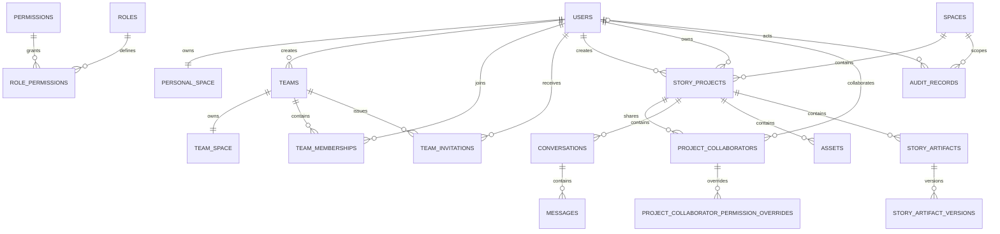

# C 端用户体系数据库表设计

## 文档状态

- 状态：设计稿
- 目标读者：后端工程师、数据库工程师、负责数据迁移和权限策略的工程师
- 读完后的动作：能够据此编写 Prisma 模型、PostgreSQL migration、权限查询和核心事务测试
- 业务依据：C 端用户体系与权限设计；该文档是目标模型的唯一业务事实来源
- 数据库：PostgreSQL
- ORM：Prisma

本文档将产品层的用户、空间、团队、项目和权限规则转换为数据库模型。表结构以用户体系规划文档为准，描述的是目标模型；当前代码和数据库只用于最后的迁移提示，不反向限制目标设计。

## 一、设计结论

### 1.1 统一空间模型

个人空间和团队空间都建模为 `spaces`：

- `spaces.kind = personal`：归属于一个用户。
- `spaces.kind = team`：归属于一个团队。
- 一个用户只能有一个个人空间。
- 一个团队只能有一个团队空间。
- 项目只通过 `space_id` 表示当前归属，不再用 `visibility` 或 `tenant_id` 同时承担归属和权限语义。

### 1.2 所有权与归属分离

`story_projects.created_by_user_id`、`story_projects.owner_user_id` 和 `story_projects.space_id` 必须保存为三个独立事实：

- `created_by_user_id`：创建项目的人，创建后不可变。
- `owner_user_id`：当前项目所有者，可以转让。
- `space_id`：项目当前所在的个人空间或团队空间，可以移动。

项目移动空间不会自动改变所有者；所有权转让也不会自动移动项目空间。

### 1.3 权限计算不依赖单一角色字段

目标模型需要表达以下三层数据；其中权限目录和角色默认权限可以先作为 Server 的固定种子，是否落表不影响业务规则：

1. 固定的团队角色和项目协作角色。
2. 受控的权限目录和角色默认权限。
3. 协作者逐人的 `allow/deny` 覆盖。

有效权限由 Server 的授权策略计算。数据库不保存一次性计算结果，也不把 `admin` 写入项目协作者表。

推荐的计算顺序为：

```text
会话与用户状态
  → 空间归属
  → 团队有效成员关系
  → 团队角色隐式权限
  → 项目所有者规则
  → 项目协作角色的权限上限与默认权限
  → 协作者 allow/deny 覆盖
  → 操作状态与归档限制
```

普通协作者的权限计算为：

```text
有效协作权限 =（角色默认权限 + allow 覆盖 - deny 覆盖）∩ 该角色允许获得的能力集合
```

`deny` 优先于角色默认权限和 `allow`。`allow` 只能在当前角色允许获得的能力集合内增加能力，不能突破角色上限：`viewer` 永远不能获得 `project.archive`；`editor` 和 `manager` 可以被单独授予或撤销 `project.archive`。项目所有者和团队管理员的系统级边界不受普通协作者覆盖。所有权转让和空间移动只允许项目所有者执行。

### 1.4 数据库与应用层的职责

数据库直接保证主键、外键、唯一性、字段枚举范围和归档字段的一致性。项目、空间和团队之间的业务关系由同一事务中的领域策略保证。以下规则不能只依赖数据库字段：

- 团队至少保留一个有效管理员。
- 项目移入团队空间时，项目所有者必须是目标团队的有效成员；转让所有权时，新所有者必须是项目所在团队的有效成员。
- 协作者必须是项目所属团队的有效成员。
- 个人空间项目不能存在有效协作者。
- 邀请接受者必须与邀请邮箱一致。
- 团队管理员对团队空间项目拥有隐式管理能力。

项目进入团队空间或完成所有权转让后，所有者可以退出团队。移除该成员关系不得修改项目的 `owner_user_id` 或 `space_id`；退出后的所有者因不再是有效团队成员而失去团队空间访问权，项目仍留在原团队空间并由团队管理员继续管理或复制。

Server 的授权策略是唯一授权入口；Controller、Agent 或客户端不得各自实现一套数据库过滤规则。Agent 不直接访问 Server 数据库。

## 二、实体关系



`PERSONAL_SPACE` 和 `TEAM_SPACE` 不是额外的物理表，而是 `spaces` 中两种 `kind` 的逻辑视图。

## 三、命名、类型与生命周期约定

| 项目       | 约定                                                                                                     |
| ---------- | -------------------------------------------------------------------------------------------------------- |
| 表名、列名 | PostgreSQL 使用 `snake_case`；应用模型使用 `camelCase` 映射                                              |
| 主键       | `UUID`，由 ORM 或数据库生成；不可使用业务可猜测的自增 ID 作为公开标识                                    |
| 时间       | `TIMESTAMPTZ(3)`；状态变更和过期判断使用数据库时间                                                       |
| 可扩展枚举 | 第一阶段使用 `VARCHAR` + `CHECK`，不使用 PostgreSQL enum，避免角色和状态演进被 enum 类型锁死             |
| JSON       | 仅用于审计快照、生成输入快照等不可用于核心连接条件的结构化数据，使用 `JSONB`                             |
| 有效关系   | `removed_at IS NULL`、`revoked_at IS NULL` 表示有效；历史关系保留，不物理删除                            |
| 软删除     | 项目归档使用 `status`、`archived_at`、`archive_purge_at`、`archived_by_user_id`；普通 API 不直接删除项目 |
| 密钥和令牌 | 只保存用途隔离后的 HMAC 摘要；不保存原始会话值、验证码、邀请令牌或 Cookie                                |
| 审计       | 业务状态变化和审计记录在同一事务提交；审计记录只追加，不提供更新接口                                     |

## 四、核心表设计

### 4.1 `users`：全局用户身份

用户是跨所有个人空间和团队的全局身份，不因退出团队而删除。

| 字段            | 类型             | 可空 | 说明                                                     |
| --------------- | ---------------- | ---- | -------------------------------------------------------- |
| `id`            | `UUID`           | 否   | 主键                                                     |
| `email`         | `VARCHAR(254)`   | 否   | 规范化后的登录邮箱；必须唯一，邀请匹配使用同一规范化规则 |
| `password_hash` | `VARCHAR(255)`   | 是   | 可选密码凭证；原始密码不落库                             |
| `display_name`  | `VARCHAR(100)`   | 是   | 用户展示名称；注册流程未收集时可在后续资料完善阶段补充   |
| `avatar_url`    | `VARCHAR(512)`   | 是   | 头像地址，不保存头像二进制                               |
| `status`        | `VARCHAR(16)`    | 否   | `active` / `disabled`                                    |
| `last_login_at` | `TIMESTAMPTZ(3)` | 是   | 最近一次成功登录时间                                     |
| `created_at`    | `TIMESTAMPTZ(3)` | 否   | 创建时间                                                 |
| `updated_at`    | `TIMESTAMPTZ(3)` | 否   | 更新时间                                                 |

约束和索引：

- `PRIMARY KEY (id)`。
- `UNIQUE (email)`；应用层必须先完成大小写、空白和 Unicode 规范化。
- `CHECK (status IN ('active', 'disabled'))`。
- `INDEX (status, created_at DESC)`，用于后台清理和状态查询。
- 用户停用使用 `status = disabled`，不通过删除用户绕过历史外键和审计关系。

### 4.2 `spaces`：个人空间与团队空间

| 字段            | 类型             | 可空 | 说明                      |
| --------------- | ---------------- | ---- | ------------------------- |
| `id`            | `UUID`           | 否   | 主键                      |
| `kind`          | `VARCHAR(16)`    | 否   | `personal` / `team`       |
| `owner_user_id` | `UUID`           | 是   | `personal` 空间的用户归属 |
| `owner_team_id` | `UUID`           | 是   | `team` 空间的团队归属     |
| `created_at`    | `TIMESTAMPTZ(3)` | 否   | 创建时间                  |
| `updated_at`    | `TIMESTAMPTZ(3)` | 否   | 更新时间                  |

核心约束：

```sql
CHECK (
  (kind = 'personal' AND owner_user_id IS NOT NULL AND owner_team_id IS NULL)
  OR
  (kind = 'team' AND owner_user_id IS NULL AND owner_team_id IS NOT NULL)
)
```

索引：

- `UNIQUE (owner_user_id) WHERE kind = 'personal'`。
- `UNIQUE (owner_team_id) WHERE kind = 'team'`。
- `INDEX (kind, created_at DESC)`。

`owner_user_id` 和 `owner_team_id` 分别外键到 `users.id`、`teams.id`，删除策略为 `RESTRICT`。创建用户或团队时，个人空间或团队空间必须在同一事务中创建；团队创建成功后才允许返回团队 ID。

### 4.3 `teams`：团队组织

| 字段                 | 类型             | 可空 | 说明                                     |
| -------------------- | ---------------- | ---- | ---------------------------------------- |
| `id`                 | `UUID`           | 否   | 主键                                     |
| `name`               | `VARCHAR(100)`   | 否   | 团队名称                                 |
| `created_by_user_id` | `UUID`           | 否   | 创建者；历史事实，不因成员关系变化而改变 |
| `created_at`         | `TIMESTAMPTZ(3)` | 否   | 创建时间                                 |
| `updated_at`         | `TIMESTAMPTZ(3)` | 否   | 更新时间                                 |

约束和索引：

- `created_by_user_id` 外键到 `users.id`，使用 `ON DELETE RESTRICT`。
- 创建团队事务必须同时插入团队空间、创建者的 `admin` 成员关系和初始幂等记录。
- `INDEX (created_by_user_id, created_at DESC)`。

### 4.4 `team_memberships`：团队成员关系

| 字段         | 类型             | 可空 | 说明                       |
| ------------ | ---------------- | ---- | -------------------------- |
| `id`         | `UUID`           | 否   | 主键                       |
| `team_id`    | `UUID`           | 否   | 团队 ID                    |
| `user_id`    | `UUID`           | 否   | 用户 ID                    |
| `role`       | `VARCHAR(16)`    | 否   | `admin` / `member`         |
| `joined_at`  | `TIMESTAMPTZ(3)` | 否   | 首次加入时间               |
| `removed_at` | `TIMESTAMPTZ(3)` | 是   | 移除时间；非空表示当前无效 |

约束和索引：

- `UNIQUE (team_id, user_id)`；同一用户在同一团队只保留一条可恢复的成员关系。
- `CHECK (role IN ('admin', 'member'))`。
- `INDEX (team_id, role) WHERE removed_at IS NULL`，用于管理员和有效成员查询。
- `INDEX (user_id, removed_at)`，用于查询用户所在团队。
- 团队管理员变更、成员移除和成员恢复必须锁定团队当前有效管理员集合，并在提交前确认至少存在一名有效 `admin`。
- 成员移除不删除行，以便邀请恢复成员、审计和历史外键继续有效。
- 成员退出或被移除时，即使该用户仍是团队空间项目的 `owner_user_id`，也不修改项目所有者和空间归属。成员关系失效后，该用户不再通过团队授权访问项目；团队管理员仍可管理或复制项目。

### 4.5 `team_invitations`：团队邀请

邀请是一次性、限时、指定邮箱的凭证，不直接授予权限。

| 字段                  | 类型             | 可空 | 说明                         |
| --------------------- | ---------------- | ---- | ---------------------------- |
| `id`                  | `UUID`           | 否   | 主键                         |
| `team_id`             | `UUID`           | 否   | 被邀请加入的团队             |
| `email`               | `VARCHAR(254)`   | 否   | 规范化邮箱                   |
| `invited_by_user_id`  | `UUID`           | 否   | 发起邀请的有效管理员         |
| `token_hash`          | `CHAR(64)`       | 否   | 邀请令牌的用途隔离 HMAC 摘要 |
| `created_at`          | `TIMESTAMPTZ(3)` | 否   | 创建时间                     |
| `expires_at`          | `TIMESTAMPTZ(3)` | 否   | 过期时间                     |
| `accepted_at`         | `TIMESTAMPTZ(3)` | 是   | 接受时间                     |
| `accepted_by_user_id` | `UUID`           | 是   | 实际接受用户                 |
| `revoked_at`          | `TIMESTAMPTZ(3)` | 是   | 撤销时间                     |

约束和索引：

- `UNIQUE (token_hash)`。
- `CHECK (expires_at > created_at)`。
- `CHECK (NOT (accepted_at IS NOT NULL AND revoked_at IS NOT NULL))`。
- 对 `(team_id, email)` 建立仅对 `accepted_at IS NULL AND revoked_at IS NULL` 生效的部分唯一索引，保证同一团队同一邮箱最多只有一条“未结束邀请”。该索引不能用数据库当前时间判断是否过期。
- `INDEX (team_id, created_at DESC, id DESC)`。
- `INDEX (expires_at)`，用于过期清理。
- 创建新邀请时，在同一事务中锁定该团队和邮箱对应的未结束邀请；如果旧邀请已过期，或管理员明确重新发送邀请，先写入旧邀请的 `revoked_at`，再插入新邀请。并发插入最终仍由部分唯一索引兜底。
- 接受邀请时锁定邀请行，并在同一事务中校验过期、撤销、已接受状态和当前登录邮箱，然后创建或恢复 `team_memberships`。

### 4.6 可选：`permissions`：受控权限目录

第一阶段不开放自定义权限。权限可以先由 Server 代码常量维护；如果需要数据库 FK、权限目录展示和权限变更审计，再增加本表。本表只保存由迁移或种子脚本维护的系统权限。

| 字段          | 类型             | 可空 | 说明                       |
| ------------- | ---------------- | ---- | -------------------------- |
| `key`         | `VARCHAR(64)`    | 否   | 主键，如 `project.archive` |
| `scope`       | `VARCHAR(16)`    | 否   | `team` / `project`         |
| `description` | `VARCHAR(200)`   | 否   | 面向开发和审计的说明       |
| `status`      | `VARCHAR(16)`    | 否   | `active` / `deprecated`    |
| `created_at`  | `TIMESTAMPTZ(3)` | 否   | 创建时间                   |
| `updated_at`  | `TIMESTAMPTZ(3)` | 否   | 更新时间                   |

第一阶段至少种子化：

```text
project.view
project.edit
project.generate
project.manage_collaborators
project.archive
project.copy
project.transfer_ownership
project.move_space
project.create
team.manage_members
team.manage_invitations
team.update_settings
team.view_audit
```

`project.create` 的完整记录为 `key = 'project.create'`、`scope = 'team'`。权限键本身不包含括号或 scope 描述。

### 4.7 可选：`roles` 与 `role_permissions`：固定角色权限边界

如果采用数据库权限目录，应同时使用 `roles` 和 `role_permissions`，避免 `role_scope + role_key` 成为无法通过外键校验的任意字符串。也可以不建这组表，直接在 Server 的授权策略中维护等价的只读常量。无论采用哪种方式，第一阶段都不开放用户自定义角色。

`roles`：

| 字段          | 类型             | 可空 | 说明                                     |
| ------------- | ---------------- | ---- | ---------------------------------------- |
| `scope`       | `VARCHAR(16)`    | 否   | `team` / `project`                       |
| `key`         | `VARCHAR(16)`    | 否   | 团队：`admin/member`；项目：三种协作角色 |
| `description` | `VARCHAR(200)`   | 否   | 角色说明                                 |
| `status`      | `VARCHAR(16)`    | 否   | `active` / `deprecated`                  |
| `created_at`  | `TIMESTAMPTZ(3)` | 否   | 创建时间                                 |
| `updated_at`  | `TIMESTAMPTZ(3)` | 否   | 更新时间                                 |

主键为 `(scope, key)`。固定种子只包含团队 `admin/member` 和项目 `viewer/editor/manager`，不包含 `owner`。

`role_permissions`：

| 字段               | 类型             | 可空 | 说明                                            |
| ------------------ | ---------------- | ---- | ----------------------------------------------- |
| `role_scope`       | `VARCHAR(16)`    | 否   | 角色范围                                        |
| `role_key`         | `VARCHAR(16)`    | 否   | 固定角色键                                      |
| `permission_scope` | `VARCHAR(16)`    | 否   | 权限范围                                        |
| `permission_key`   | `VARCHAR(64)`    | 否   | 权限目录键                                      |
| `default_effect`   | `VARCHAR(8)`     | 否   | 角色默认值：`allow` / `deny`                    |
| `allow_override`   | `BOOLEAN`        | 否   | 是否允许该角色通过逐人 `allow` 覆盖获得这项能力 |
| `created_at`       | `TIMESTAMPTZ(3)` | 否   | 创建时间                                        |

约束和索引：

- 主键为 `(role_scope, role_key, permission_key)`。
- `(role_scope, role_key)` 外键到 `roles(scope, key)`。
- `permissions` 增加 `UNIQUE (scope, key)`，`(permission_scope, permission_key)` 复合外键到 `permissions(scope, key)`。
- `CHECK (permission_scope = role_scope)`，保证项目协作角色只能关联项目权限、团队角色只能关联团队权限。
- `CHECK (default_effect IN ('allow', 'deny'))`。

`role_permissions` 同时表达角色默认能力和逐人授权上限：

- `viewer + project.archive` 必须种子化为 `default_effect = deny`、`allow_override = false`。
- `editor/manager + project.archive` 可以设置 `allow_override = true`，具体默认值由固定权限种子决定。
- `project.transfer_ownership` 和 `project.move_space` 不得关联任何普通项目角色。
- 没有对应 `role_permissions` 记录的能力，视为 `default_effect = deny`、`allow_override = false`。

这组表不能替代项目所有者规则和团队管理员隐式权限。采用代码常量时，必须维护完全相同的角色上限，并使用同一组测试验证。

### 4.8 `story_projects`：项目

| 字段                  | 类型             | 可空 | 说明                             |
| --------------------- | ---------------- | ---- | -------------------------------- |
| `id`                  | `UUID`           | 否   | 主键                             |
| `space_id`            | `UUID`           | 否   | 当前个人空间或团队空间           |
| `created_by_user_id`  | `UUID`           | 否   | 创建者，创建后不可变             |
| `owner_user_id`       | `UUID`           | 否   | 当前所有者，可转让               |
| `title`               | `VARCHAR(200)`   | 否   | 项目名称                         |
| `status`              | `VARCHAR(16)`    | 否   | `active` / `archived`            |
| `archived_at`         | `TIMESTAMPTZ(3)` | 是   | 归档时间                         |
| `archive_purge_at`    | `TIMESTAMPTZ(3)` | 是   | 计划硬删除时间，默认归档后 30 天 |
| `archived_by_user_id` | `UUID`           | 是   | 执行归档的用户                   |
| `revision`            | `INTEGER`        | 否   | 乐观并发版本，初始为 1           |
| `created_at`          | `TIMESTAMPTZ(3)` | 否   | 创建时间                         |
| `updated_at`          | `TIMESTAMPTZ(3)` | 否   | 更新时间                         |

归档字段必须满足以下一致性：

```sql
CHECK (
  (status = 'active'
   AND archived_at IS NULL
   AND archive_purge_at IS NULL
   AND archived_by_user_id IS NULL)
  OR
  (status = 'archived'
   AND archived_at IS NOT NULL
   AND archive_purge_at IS NOT NULL
   AND archived_by_user_id IS NOT NULL
   AND archive_purge_at >= archived_at)
)
```

索引和约束：

- `PRIMARY KEY (id)`。
- `space_id` 外键到 `spaces.id`，使用 `ON DELETE RESTRICT`。
- `created_by_user_id`、`owner_user_id`、`archived_by_user_id` 外键到 `users.id`，历史数据不得因用户停用而断裂。
- `CHECK (revision > 0)`。
- `INDEX (space_id, status, created_at DESC, id DESC)`。
- `INDEX (owner_user_id, status, updated_at DESC)`。
- `INDEX (archive_purge_at) WHERE status = 'archived'`，供回收任务扫描。

`space_id`、`owner_user_id` 的跨表组合关系必须由创建项目、移动空间和转让所有权事务校验：项目进入团队空间时，所有者必须是该团队有效成员；团队空间项目转让时，新所有者必须是该团队有效成员；个人空间项目的所有者必须等于个人空间所有者。团队成员后续退出时，不重新要求历史所有者仍为有效成员，也不修改项目归属和所有权。

目标模型不再把 `visibility` 当作空间归属或授权字段。若产品仍需要“团队空间内仅指定成员可见”，应另行增加 `access_mode` 和对应授权设计，不得复用 `visibility` 产生第三种含义。

归档权限按授权策略计算：项目所有者、团队空间管理员，以及拥有 `project.archive` 的有效 `editor` 或 `manager` 可以归档；`viewer` 即使存在错误的 `allow` 覆盖也不能归档。具体操作仍需通过同一事务写入归档字段和审计记录。

### 4.9 `project_collaborators`：项目协作者

| 字段         | 类型             | 可空 | 说明                             |
| ------------ | ---------------- | ---- | -------------------------------- |
| `id`         | `UUID`           | 否   | 主键                             |
| `project_id` | `UUID`           | 否   | 项目 ID                          |
| `user_id`    | `UUID`           | 否   | 协作者用户 ID                    |
| `role`       | `VARCHAR(16)`    | 否   | `viewer` / `editor` / `manager`  |
| `created_at` | `TIMESTAMPTZ(3)` | 否   | 添加时间                         |
| `updated_at` | `TIMESTAMPTZ(3)` | 否   | 最近调整时间                     |
| `revoked_at` | `TIMESTAMPTZ(3)` | 是   | 撤销时间；非空表示不再产生访问权 |

约束和索引：

- `CHECK (role IN ('viewer', 'editor', 'manager'))`。
- 对 `(project_id, user_id)` 建立 `WHERE revoked_at IS NULL` 的部分唯一索引，保证同一时间只有一条有效关系。
- `INDEX (project_id, revoked_at, created_at DESC)`。
- `project_id` 外键到 `story_projects.id`；项目所在空间通过项目关系确定，不在协作者表重复保存。
- 项目所有者不写入该表；团队管理员也不写入该表。
- 个人空间项目不得存在有效协作者；项目移回个人空间时，原团队协作者统一写入 `revoked_at`，历史记录保留。

协作者的基础角色不代表不可变的完整权限集合。具体能力由 `role_permissions` 或等价的 Server 固定角色矩阵与覆盖表共同计算。

### 4.10 `project_collaborator_permission_overrides`：协作者逐人权限覆盖

| 字段                 | 类型             | 可空 | 说明                   |
| -------------------- | ---------------- | ---- | ---------------------- |
| `id`                 | `UUID`           | 否   | 主键                   |
| `collaborator_id`    | `UUID`           | 否   | 协作者关系             |
| `permission_key`     | `VARCHAR(64)`    | 否   | 受控权限目录键         |
| `effect`             | `VARCHAR(8)`     | 否   | `allow` / `deny`       |
| `granted_by_user_id` | `UUID`           | 否   | 最近设置该覆盖的操作者 |
| `created_at`         | `TIMESTAMPTZ(3)` | 否   | 首次设置时间           |
| `updated_at`         | `TIMESTAMPTZ(3)` | 否   | 最近更新时间           |

约束和索引：

- `UNIQUE (collaborator_id, permission_key)`。
- `CHECK (effect IN ('allow', 'deny'))`。
- 采用 `permissions` 表时，`permission_key` 外键到 `permissions.key`；不采用时由 Server 的受控权限目录校验。
- `granted_by_user_id` 外键到 `users.id`。
- `INDEX (permission_key, effect)`，供权限审计和迁移使用。
- 写入 `effect = allow` 前必须按协作者当前角色检查授权上限：采用 `role_permissions` 表时要求对应记录的 `allow_override = true`；不采用时由 Server 的等价角色矩阵校验。
- `viewer + project.archive + allow` 必须被拒绝；`project.transfer_ownership` 和 `project.move_space` 永远不能通过本表生效。
- 协作者角色变更时必须重新验证现有覆盖；如果覆盖超出新角色上限，应在同一事务中撤销或删除该覆盖并写入审计记录。
- 增删改覆盖和协作者关系状态变更必须在同一事务中完成，并写入审计记录。

## 五、项目子表与空间边界

项目子表不单独决定授权。它们通过父级项目、对话或成果关系间接确定 `space_id`，不重复承担空间归属。目标模型不要求在每张子表保存 `tenant_id` 或冗余 `space_id`。

| 表                          | 关键字段                                                                                                                                                                                                                                    | 目标边界与约束                                                                             |
| --------------------------- | ------------------------------------------------------------------------------------------------------------------------------------------------------------------------------------------------------------------------------------------- | ------------------------------------------------------------------------------------------ |
| `conversations`             | `id`, `project_id`, `title`, `status`, `revision`, `created_at`, `updated_at`                                                                                                                                                               | `project_id` 外键到项目；归档项目不能创建或修改对话，已归档对话保留可读历史                |
| `messages`                  | `id`, `conversation_id`, `author_type`, `author_user_id`, `body`, `created_at`                                                                                                                                                              | 对话内追加写入；`conversation_id` 外键到对话                                               |
| `story_generation_requests` | `id`, `conversation_id`, `trigger_message_id`, `idempotency_key`, `input_snapshot`, `status`, `failure_code`, `processing_started_at`, `completed_at`, `agent_message_id`, `artifact_id`, `artifact_version_id`, `created_at`, `updated_at` | 同一触发消息只能生成一个请求；消息、pending 请求和幂等结果原子提交                         |
| `assets`                    | `id`, `project_id`, `uploaded_by_user_id`, `object_key`, `original_file_name`, `content_type`, `byte_size`, `checksum`, `status`, `upload_expires_at`, `completed_at`, `created_at`, `updated_at`                                           | `project_id` 外键到项目；对象存储文件和数据库状态必须有明确清理策略；`object_key` 全局唯一 |
| `story_artifacts`           | `id`, `project_id`, `type`, `title`, `status`, `current_version_id`, `created_at`, `updated_at`                                                                                                                                             | 成果属于项目而不是对话；当前版本必须属于同一成果                                           |
| `story_artifact_versions`   | `id`, `artifact_id`, `version_number`, `content`, `content_format`, `status`, `source_type`, `source_message_id`, `generation_request_id`, `created_by_user_id`, `created_at`                                                               | `(artifact_id, version_number)` 唯一；版本只追加，不覆盖历史                               |

这些表的通用索引模式为：

- 列表：`(parent_id, created_at DESC, id DESC)`。
- 状态筛选：`(parent_id, status, created_at DESC)`。
- 所有访问必须先加载根项目并执行统一授权，再查询子数据；不能因为子表存在某个冗余范围字段就绕过项目授权。

项目子数据在项目硬删除时按依赖顺序清理；如果对象存储、消息、成果或生成请求不能安全级联删除，应先写入清理任务，再执行数据库删除。

## 六、审计、幂等与身份安全表

### 6.1 `audit_records`：业务审计

审计范围使用 `space_id`，使个人项目和团队空间项目都能记录归档、恢复、复制、转让和空间移动。团队审计通过团队空间筛选；个人项目审计通过个人空间筛选。

| 字段             | 类型             | 可空 | 说明                                   |
| ---------------- | ---------------- | ---- | -------------------------------------- |
| `id`             | `UUID`           | 否   | 主键                                   |
| `space_id`       | `UUID`           | 否   | 审计所属空间；团队审计通过团队空间查询 |
| `actor_type`     | `VARCHAR(16)`    | 否   | `user` / `system`                      |
| `actor_user_id`  | `UUID`           | 是   | 用户操作者；系统任务执行时为空         |
| `action`         | `VARCHAR(64)`    | 否   | 业务动作，如 `PROJECT_ARCHIVED`        |
| `target_type`    | `VARCHAR(64)`    | 否   | `project`、`team_membership` 等        |
| `target_id`      | `UUID`           | 否   | 目标对象 ID                            |
| `before_summary` | `JSONB`          | 是   | 脱敏后的变更前摘要                     |
| `after_summary`  | `JSONB`          | 是   | 脱敏后的变更后摘要                     |
| `request_id`     | `VARCHAR(128)`   | 否   | 请求或链路 ID                          |
| `occurred_at`    | `TIMESTAMPTZ(3)` | 否   | 数据库时间                             |

约束和索引：

- `space_id` 外键到 `spaces.id`，`actor_user_id` 外键到 `users.id`。
- `CHECK ((actor_type = 'user' AND actor_user_id IS NOT NULL) OR (actor_type = 'system' AND actor_user_id IS NULL))`。
- `INDEX (space_id, occurred_at DESC, id)`。
- `INDEX (target_type, target_id, occurred_at DESC)`。
- 审计快照不得包含密码、令牌、Cookie、模型密钥或完整对象存储签名 URL。
- 团队成员移除后仍保留成员关系历史，因此审计记录不能因为成员移除而失效。
- 系统硬删除使用 `actor_type = system`，写入 `PROJECT_PURGED`；该审计记录不对已删除项目建立外键，使用 `target_id` 和清理摘要保留追溯信息。

### 6.2 `idempotency_records`：幂等结果

幂等记录是支撑性表，不改变用户体系的业务模型。需要支持用户范围和空间范围的操作时，建议使用：

| 字段              | 类型             | 说明                                      |
| ----------------- | ---------------- | ----------------------------------------- |
| `id`              | `UUID`           | 主键                                      |
| `scope_type`      | `VARCHAR(16)`    | `user` / `space` / `team`                 |
| `scope_id`        | `UUID`           | 与 `scope_type` 对应的用户、空间或团队 ID |
| `operation_type`  | `VARCHAR(64)`    | 操作类型                                  |
| `idempotency_key` | `VARCHAR(128)`   | 客户端幂等键                              |
| `request_hash`    | `CHAR(64)`       | 请求体摘要；同一键不同请求必须报错        |
| `result_type`     | `VARCHAR(64)`    | 结果类型                                  |
| `result_id`       | `UUID`           | 结果对象 ID                               |
| `created_at`      | `TIMESTAMPTZ(3)` | 创建时间                                  |

唯一约束为 `(scope_type, scope_id, operation_type, idempotency_key)`。创建团队这种操作没有既有团队空间，应使用 `scope_type = user`；创建团队成功后再写入团队范围的幂等记录。

### 6.3 身份安全表

以下表属于身份模块，不与项目授权表混合：

| 表                         | 关键字段                                                                                                           | 安全约束                                                            |
| -------------------------- | ------------------------------------------------------------------------------------------------------------------ | ------------------------------------------------------------------- |
| `sessions`                 | `id`, `user_id`, `token_hash`, `expires_at`, `revoked_at`, `created_at`                                            | 只保存令牌摘要；按用户、过期时间建立索引；Cookie 只在 HTTP 边界出现 |
| `email_login_challenges`   | `id`, `email`, `token_hash`, `source_digest`, `expires_at`, `attempt_count`, `consumed_at`, `created_at`           | 一次性消费、过期和尝试次数；不保存原始登录令牌                      |
| `email_verification_codes` | `id`, `email`, `purpose`, `code_hash`, `source_digest`, `expires_at`, `attempt_count`, `consumed_at`, `created_at` | `purpose` 隔离登录、设置密码和重置密码；不保存原始验证码            |
| `identity_security_events` | `id`, `user_id`, `session_id`, `action`, `target_id`, `request_id`, `occurred_at`                                  | 登录、登出、验证码失败、会话撤销等安全事件追加写入                  |

身份安全表的挑战消费、用户或会话创建、撤销和安全事件必须在规定的事务边界内完成，并使用数据库时间。密码凭证只保留在 `users.password_hash` 或独立凭证表中，不能保存明文密码。

## 七、关键业务事务

### 7.1 创建用户

```text
创建 users
  → 创建 kind=personal 的 spaces
  → 提交
```

同一用户的个人空间由部分唯一索引兜底，重复请求通过幂等策略处理。

### 7.2 创建团队

```text
锁定创建者用户
  → 插入 teams
  → 插入 kind=team 的 spaces
  → 插入 team_memberships(role=admin)
  → 写入幂等结果和审计记录
  → 提交
```

任何一步失败都不能留下没有空间、没有管理员或没有成员关系的团队。

### 7.3 接受邀请

```text
锁定 team_invitations
  → 校验 token 摘要、未过期、未接受、未撤销
  → 校验当前登录用户邮箱等于邀请邮箱
  → 创建或恢复 team_memberships(role=member)
  → 更新邀请 accepted_at / accepted_by_user_id
  → 写入审计记录
  → 提交
```

接受邀请不能通过请求参数指定 `admin`。管理员角色只能由有效管理员发起后续成员管理操作授予。

### 7.4 将个人项目移入团队空间

```text
锁定项目和目标团队
  → 校验当前用户是 owner_user_id
  → 校验目标团队成员关系有效
  → 校验 team 级 project.create 权限
  → 更新 project.space_id
  → 保持 owner_user_id 不变
  → 写入审计记录
  → 提交
```

不允许把项目直接移动到没有对应团队空间的空间，也不允许通过修改 `space_id` 绕过团队成员和权限校验。

### 7.5 将团队项目移回个人空间

```text
锁定项目和目标个人空间
  → 校验当前用户是项目 owner_user_id
  → 校验目标个人空间属于当前用户
  → 更新 project.space_id
  → 将有效协作者标记 revoked_at
  → 保留历史覆盖记录
  → 写入审计记录
  → 提交
```

团队协作者关系不应在移回个人空间后继续产生访问权。数据库只负责保留已失效的历史关系，不预设项目重新移入团队时是否恢复协作者；自动恢复、由所有者选择恢复或始终不恢复属于尚待确认的产品规则。规则确认后应先更新用户体系设计，再实现对应事务和审计行为。

### 7.6 转让项目所有权

```text
锁定项目和转让目标用户的成员关系
  → 校验当前用户是 owner_user_id
  → 校验目标用户是项目所在团队的有效成员
  → 更新 owner_user_id 和 revision
  → 写入审计记录
  → 提交
```

个人空间项目不能转让给其他用户；团队空间项目不能转让给团队外用户。转让不改变 `created_by_user_id` 和 `space_id`。

### 7.7 归档、恢复与硬删除

- 归档：更新项目状态和四个归档字段，写审计。
- 恢复：仅允许在 `archive_purge_at` 之前执行，恢复到原 `space_id`，清空归档字段，写审计。
- 扫描：系统任务按 `status = archived AND archive_purge_at <= database_now()` 获取任务。
- 硬删除：先清理对象存储和项目子数据；最终删除项目的数据库事务必须同时写入 `actor_type = system` 的 `PROJECT_PURGED` 审计记录。失败时保留可重试的清理记录。
- 管理员复制：创建全新项目 ID，`created_by_user_id` 和 `owner_user_id` 都设置为复制者，目标 `space_id` 为复制者个人空间，不复制协作者和权限覆盖。

归档、恢复、复制和清理任务都必须具备幂等行为；重复执行不能产生第二个副本、第二条恢复审计或半清理项目。

## 八、附录：现有实现迁移提示

本节只服务于已有实现的迁移，不是目标模型的来源，也不改变前文的业务定义。迁移应使用可回滚的小步骤，每一步都先补数据和约束，再切换读写，最后删除旧字段。不能直接重命名后让所有运行中的代码同时切换。

### 阶段 0：冻结旧语义

- 明确本文档中的 `space_id` 是新的唯一归属字段。
- 停止新增依赖 `visibility` 表示归属的代码。
- 保留当前 API 兼容映射，但禁止新业务继续把所有项目当作团队项目。

### 阶段 1：创建空间并回填

- 为每个现有用户创建一个个人空间。
- 为每个现有团队创建一个团队空间。
- 为 `spaces.owner_user_id`、`spaces.owner_team_id` 建立部分唯一索引。
- 验证每个用户和团队恰好有一个对应空间。

### 阶段 2：迁移项目归属和所有权

- 为 `story_projects` 增加可空 `space_id`、`owner_user_id`、归档字段。
- 当前团队项目按 `tenant_id` 回填到对应团队空间。
- 当前项目创建者作为初始 `owner_user_id`，除非产品已有明确的其他所有者数据。
- 回填完成后增加非空约束、复合唯一键和复合外键。
- 新旧字段双写并校验一段时间，再切换读取，最后移除 `tenant_id` 和旧归属语义。

### 阶段 3：迁移项目子表

- 按前文目标模型，将项目子表恢复为通过 `project_id`、`conversation_id` 或 `artifact_id` 关联父对象。
- 当前实现中的 `tenant_id` 只是过渡性冗余范围字段；是否保留冗余 `space_id` 只能作为性能或隔离优化，不能改变父级关系才是业务归属来源的原则。
- 保持消息触发生成请求、成果版本、对象归属的普通外键和唯一约束。
- 迁移完成前禁止只按旧 `tenant_id` 读取项目子数据；查询必须先确定项目并通过统一授权策略。

### 阶段 4：迁移协作者和权限

- 为协作者增加 `role`、`updated_at`、`revoked_at`。
- 回填已有协作者为 `editor` 或产品确认的初始角色。
- 确定使用 Server 固定角色矩阵或数据库权限目录；如果落表，同时创建权限、角色、默认权限和 `allow_override` 上限种子。
- 增加逐人覆盖表，并将旧的“项目可编辑”判断迁移到统一授权策略。
- 团队管理员能力保持为计算得到的隐式权限，不回填为协作者。

### 阶段 5：迁移审计和幂等

- 将业务审计范围从 `tenant_id` 泛化为 `space_id`，使个人空间也能记录业务审计。
- 对已有团队审计按团队空间回填 `space_id`。
- 为已有用户审计回填 `actor_type = user`，并允许系统清理任务使用 `actor_type = system`、`actor_user_id = NULL`。
- 对需要用户范围的操作补充 `scope_type = user` 的幂等记录。
- 验证状态变更和审计记录仍然同事务提交。

### 必须在迁移前确认的兼容问题

当前实现存在 `visibility = private/team`，而目标设计使用空间归属和团队权限。原有“团队内私人项目”不能在没有产品决策的情况下静默映射：

- 如果目标文档已完全取代旧语义，应将这类项目移动到所有者个人空间，或明确接受其进入团队空间后的新权限范围。
- 如果仍需保留团队内私有项目，应新增独立的 `access_mode` / 受限访问模型，不得把 `visibility` 继续复用为 `space_id` 的替代品。

## 九、索引、约束与并发检查清单

### 必须落在数据库的约束

- 用户邮箱唯一。
- 一个用户只有一个个人空间，一个团队只有一个团队空间。
- 空间类型与 owner 字段互斥且匹配。
- 一个团队同一用户只有一条成员历史关系。
- 同一团队同一邮箱只有一条未接受、未撤销的邀请；创建新邀请前必须结束旧的过期或被替换邀请。
- 邀请令牌摘要唯一。
- 项目状态与归档字段一致。
- 同一项目同一用户只有一条有效协作者关系。
- 同一协作者同一权限只有一条覆盖。
- 采用数据库权限目录时，角色权限必须同时引用合法角色和权限，并保存 `allow_override` 上限。
- 审计操作者类型与用户字段一致：用户事件必须有用户，系统事件不得伪造用户。
- 同一触发消息只有一个生成请求。
- 所有项目子数据通过父级外键属于正确的项目、对话或成果。

### 必须通过事务和行锁保证的规则

- 最后一个管理员不能被移除或降级。
- 邀请不能被重复接受。
- 项目所有权转让不能覆盖并发更新。
- 项目不能在归档后被创建或修改子数据。
- 协作者角色变化不能遗留超出新角色上限的 `allow` 覆盖。
- 空间移动、协作者撤销和审计记录必须原子提交。
- 复制操作在重试时不能创建多个副本。
- 回收任务不能和恢复操作互相覆盖。

### 建议的锁顺序

涉及项目的事务统一按以下顺序获取锁，减少死锁：

```text
space → team / membership → project → collaborator → project child → audit / idempotency
```

实际实现可以使用 `SELECT ... FOR UPDATE` 或等价的 Prisma 事务操作；锁的范围必须与授权校验读取的范围一致。

## 十、测试验收项

### 空间与成员

- 新用户只有一个个人空间，不自动加入团队。
- 用户可以创建多个团队，每个团队都有且只有一个团队空间。
- 创建者自动成为唯一初始管理员。
- 邀请只允许指定邮箱的已认证用户接受，且只能接受一次。
- 邀请过期后可以安全创建新邀请，旧令牌仍然无效。
- 并发移除或降级管理员不会导致团队没有有效管理员。

### 项目与权限

- 个人项目只允许所有者访问，不能创建有效协作者。
- 团队成员能按团队默认权限访问团队空间项目。
- 团队管理员的项目管理权限来自团队角色，不产生协作者行。
- 同一项目的多个协作者可以拥有不同角色和不同 allow/deny 覆盖。
- `viewer` 的 `project.archive + allow` 覆盖被拒绝，不能把无效覆盖写入数据库。
- `editor` 和 `manager` 可以被单独授予或撤销 `project.archive`。
- 协作者被撤销后覆盖记录不再生效，但历史审计仍完整。
- 所有权只能转让给目标团队有效成员，不能转让给团队外用户。
- 项目移入团队前必须同时满足成员关系和 `project.create` 权限。
- 项目所有者退出团队后，项目仍留在原团队空间，`owner_user_id` 不变，退出者失去团队访问权。
- 项目所有者退出团队后，团队管理员仍能管理项目并复制到自己的个人空间，复制不改变原项目所有权。
- 项目移回个人空间后团队协作者不再有访问权。
- 项目重新移入团队时，历史协作者是否恢复必须遵循已经回写用户体系设计的产品规则，并覆盖自动、选择性或不恢复的对应测试。
- 复制项目产生新 ID，且副本不受原项目后续变化影响。

### 生命周期与一致性

- 归档项目 30 天内可恢复到原空间。
- 过期归档项目只能由系统任务硬删除。
- 硬删除写入 `actor_type = system` 的 `PROJECT_PURGED` 审计，且审计在项目删除后仍可查询。
- 项目、消息、成果、对象存储文件的清理策略可重试且幂等。
- 并发归档、恢复、转让、移动和复制不会产生越权或脏状态。
- 所有业务状态变化都有同事务的审计记录。
- 原始令牌、验证码、密码和 Cookie 不会出现在数据库或审计快照中。

## 十一、落地顺序

1. 稳定领域常量：空间类型、团队角色、项目角色、权限键和状态。
2. 增加 `spaces`、空间唯一约束和用户/团队空间回填。
3. 为项目增加 `space_id`、`owner_user_id` 和归档字段。
4. 将项目子表从旧的 `tenant_id` 范围依赖迁移为目标文档定义的父级外键关系。
5. 扩展协作者角色、撤销状态和逐人权限覆盖。
6. 确定使用 Server 固定常量或数据库权限目录；如落表，同时创建 `permissions`、`roles`、`role_permissions` 和角色授权上限种子。
7. 统一项目授权策略，覆盖所有读写、生成、复制、移动、转让和生命周期操作。
8. 泛化审计和幂等范围，支持个人空间操作。
9. 执行历史 `visibility` 语义迁移，并删除旧字段。
10. 补齐 PostgreSQL 约束、并发测试、HTTP 授权测试和数据迁移验证。
