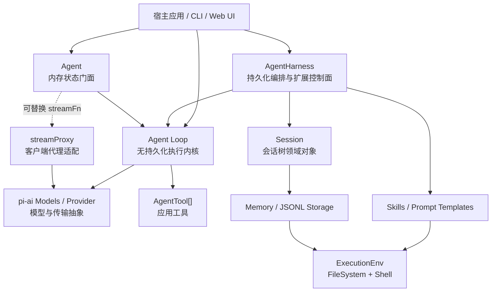
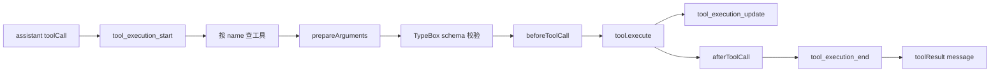

# Pi Agent 技术架构拆解

> 分析对象：`vendor/pi/packages/agent`
> 分析基线：`@earendil-works/pi-agent-core` 0.80.10
> 文档性质：基于源码、测试和包内现有文档的静态架构分析快照
> 目标读者：需要理解、复用或改造 Agent Runtime 的工程师

## 1. 结论先行

Pi Agent 不是一个把消息数组传给大模型的轻量封装，而是一套分层的 Agent Runtime。它把不同稳定性、不同生命周期的问题拆成了四层：

1. **Agent Loop**：无持久化的执行内核，负责模型调用、流式事件、工具调用和多轮循环。
2. **Agent**：有内存状态的易用门面，负责 transcript、运行互斥、订阅者、steering/follow-up 队列和中止控制。
3. **AgentHarness**：面向应用的持久化编排层，负责会话树、运行快照、save point、Hook、资源、压缩和分支导航。
4. **Adapter 与基础能力**：代理传输、文件系统、Shell、JSONL/内存存储、Skill 和 Prompt Template 加载器。

这套架构最重要的设计不是某个类，而是以下边界：

- Provider 协议和模型能力属于 `pi-ai`；Agent 包只消费统一的 `Models`、`Model`、`Message` 和流式事件。
- 模型可见消息与应用消息分离，`AgentMessage` 可以扩展，真正请求模型前才投影为标准 `Message`。
- 核心循环不依赖持久化；持久化通过事件屏障和 Harness 编排接入。
- 会话不是线性数组，而是 append-only 的树形日志；“当前对话”由活动叶子回溯得到。
- 配置变更不直接篡改正在进行的 Provider 请求，而是在 turn 边界重新构造快照。
- 工具调用的准备、执行、后处理、事件发布和 transcript 落盘是不同阶段。
- 预期失败在底层能力边界使用 `Result`，高层编排 API 使用带稳定错误码的异常。

从复用角度看，最值得借鉴的是 **Loop 与 Harness 分离、事件即屏障、会话树、turn snapshot、双层 Hook、可扩展消息投影**。最需要谨慎评估的是 **Hook 重入、JSONL 并发写、原始 EventStream 的消费语义、代理协议健壮性和自动压缩接入程度**。

## 2. 包的职责与非职责

### 2.1 包负责什么

该包负责：

- Agent 多轮状态机；
- assistant 流式响应还原；
- 工具参数兼容、校验、拦截、执行、增量更新和结果归一化；
- steering、follow-up、next-turn 三类排队语义；
- 运行生命周期事件；
- 内存 transcript 状态；
- 持久化会话树及分支切换；
- 上下文压缩和分支摘要；
- Skill、Prompt Template 的发现和格式化；
- 文件系统和 Shell 能力抽象；
- 浏览器/客户端经代理服务器访问模型的流式协议适配。

### 2.2 包不负责什么

该包刻意不负责：

- 具体 Provider 的 HTTP 协议；
- 模型目录、认证和原始请求重试的核心实现；
- UI 渲染；
- 应用级工具集合；
- Skill/Prompt Template 从哪些业务位置加载；
- Session 加密、多进程锁和数据库事务；
- OpenTelemetry/Sentry 等具体可观测性 SDK；
- 业务级权限、审批和沙箱策略。

这些能力应由 `pi-ai`、宿主应用或专门 Adapter 提供。

## 3. 源码模块地图

| 模块                              | 主要职责                                    | 所在层       |
| --------------------------------- | ------------------------------------------- | ------------ |
| `src/types.ts`                    | 核心消息、状态、事件、工具、Loop 配置契约   | 公共契约     |
| `src/agent-loop.ts`               | Agent 多轮循环和工具执行流水线              | 执行内核     |
| `src/agent.ts`                    | 内存状态门面和运行生命周期                  | 状态门面     |
| `src/proxy.ts`                    | SSE 代理传输与 partial message 重建         | 传输适配     |
| `src/harness/agent-harness.ts`    | 持久化编排、Hook、快照、队列和结构化操作    | 应用编排     |
| `src/harness/types.ts`            | Harness、存储、环境、事件和错误契约         | Harness 契约 |
| `src/harness/session/*`           | 会话树、存储与仓库实现                      | 持久化       |
| `src/harness/compaction/*`        | token 估算、切点、摘要和文件操作提取        | 上下文治理   |
| `src/harness/messages.ts`         | 自定义消息注册及 LLM 投影                   | 消息适配     |
| `src/harness/skills.ts`           | Skill 扫描、忽略规则、校验和格式化          | 资源系统     |
| `src/harness/prompt-templates.ts` | Prompt Template 加载、参数解析与替换        | 资源系统     |
| `src/harness/system-prompt.ts`    | Skill 元数据的 XML 格式化                   | Prompt 组装  |
| `src/harness/env/nodejs.ts`       | Node 文件系统和 Shell 实现                  | 运行时适配   |
| `src/harness/utils/*`             | Shell 输出捕获、二进制净化和 UTF-8 安全截断 | 基础工具     |
| `src/index.ts`                    | 浏览器安全/运行时中立的公共导出             | 包入口       |
| `src/node.ts`                     | 额外导出 Node 专用执行环境                  | Node 子入口  |

包提供两个入口：

- 根入口导出核心 Agent、Harness、Session、压缩、资源加载和代理能力；
- `node` 子入口在根入口之上增加 `NodeExecutionEnv`，避免根入口静态依赖 Node 内置模块。

## 4. 总体分层



需要注意，`Agent` 和 `AgentHarness` 不是严格的继承关系。它们都直接使用低层 Loop：

- `Agent` 适合只需要进程内状态和 UI 事件的调用方；
- `AgentHarness` 适合需要持久化、分支、Hook、资源和上下文治理的应用；
- 高级应用不必先实例化 `Agent` 再套 Harness。

## 5. 核心数据模型

### 5.1 Message 与 AgentMessage

`pi-ai` 定义的标准 `Message` 只包含模型能理解的角色，例如：

- `user`；
- `assistant`；
- `toolResult`。

Agent 包定义的 `AgentMessage` 是：

```text
AgentMessage = pi-ai Message | 应用通过声明合并加入的自定义消息
```

Harness 默认加入四种自定义消息：

- `bashExecution`：Shell 命令、输出、退出码和截断元数据；
- `custom`：任意应用消息；
- `branchSummary`：离开旧分支时生成的摘要；
- `compactionSummary`：历史压缩摘要。

消息送给模型前经过两步：

```text
AgentMessage[]
  -> transformContext()     // 在 AgentMessage 层裁剪或注入
  -> convertToLlm()         // 过滤或转换为模型消息
  -> Message[]
  -> Provider
```

这个边界允许 UI 状态、Shell 记录、摘要和业务事件进入统一 transcript，同时不会强迫 Provider 认识这些类型。

### 5.2 AgentContext

一次 Loop 所需上下文由三部分组成：

- `systemPrompt`；
- `messages`；
- `tools`。

它是可变运行快照，不等同于持久化 Session，也不等同于 `Agent.state` 的长期状态。

### 5.3 AgentState

内存 `Agent` 暴露：

- 当前 system prompt；
- 当前模型；
- thinking level；
- 工具列表；
- transcript；
- 是否运行中；
- 当前 partial assistant message；
- 正在执行的 tool call id 集合；
- 最近 assistant 错误。

工具数组和消息数组在赋值时只做顶层复制。读取后直接修改返回数组会修改当前状态。这不是深度不可变模型。

### 5.4 AgentTool

工具在 `pi-ai Tool` 的基础上增加：

- UI label；
- `prepareArguments` 兼容层；
- `execute`；
- 可选 per-tool execution mode。

工具执行结果包含：

- 文本或图片内容；
- 任意结构化 details；
- 可选 `addedToolNames`；
- 可选 `terminate`。

`details` 主要给日志/UI，`content` 进入 tool result 并反馈给模型。

## 6. Agent Loop：真正的执行内核

### 6.1 对外形态

Loop 有两组 API：

- `agentLoop` / `agentLoopContinue`：返回 `EventStream`，方便 `for await` 消费；
- `runAgentLoop` / `runAgentLoopContinue`：接收 awaited `emit` 回调，方便 `Agent` 和 Harness 把事件变成执行屏障。

新 prompt 与 continuation 的区别：

- 新 prompt 会先把传入消息加入上下文并发出 message start/end；
- continuation 不添加新消息，要求上下文非空且最后一条不能是 assistant；
- continuation 适合从已有 user/toolResult 尾部重试。

### 6.2 双层循环

Loop 使用一个 outer loop 和一个 inner loop：

- inner loop 处理工具调用和 steering；
- outer loop 在本应结束时检查 follow-up。

伪代码如下：

```text
读取初始 steering
while true:                                 // follow-up 层
  hasMoreToolCalls = true
  while hasMoreToolCalls or pendingSteering:
    发 turn_start
    注入 pending messages
    请求并流式接收 assistant
    如果 error/aborted: 正常结束生命周期
    执行 tool calls
    发 turn_end
    prepareNextTurn 刷新运行快照
    shouldStopAfterTurn 可优雅停止
    读取 steering
  读取 follow-up
  如果没有 follow-up: break
发 agent_end
```

### 6.3 单次模型请求

每次请求的步骤是：

1. 读取当前 `AgentContext.messages`；
2. 可选执行 `transformContext`；
3. 必须执行 `convertToLlm`；
4. 组装标准 `Context`；
5. 每次请求动态解析 API key；
6. 调用 `streamFn`，默认是 `streamSimple`；
7. 将 Provider stream 还原为 partial assistant message；
8. 发出 `message_start`、多个 `message_update`、`message_end`；
9. 用 final message 替换上下文中的 partial message。

动态 `getApiKey` 放在每次请求前，专门支持运行过程中可能过期的 OAuth token。

### 6.4 StreamFn 契约

`StreamFn` 的关键契约是：请求、模型或运行时失败不应通过 rejected promise 表达，而应通过流中的 error 协议事件和最终 assistant message 表达。最终消息的 stop reason 应为 `error` 或 `aborted`，并携带 `errorMessage`。

Loop 自身的一些回调仍可能抛出，例如上下文转换、事件 sink 或 Hook。高层 `Agent` 和 Harness 会将这种异常补成完整的失败生命周期。

## 7. 工具调用流水线

### 7.1 五阶段模型

每个工具调用可以拆成五个阶段：

1. **开始事件**：发出 `tool_execution_start`；
2. **准备**：查找工具、兼容参数、schema 校验、执行前 Hook；
3. **执行**：调用工具并接收增量 update；
4. **收尾**：执行后 Hook 覆盖结果；
5. **发布**：发出 execution end，构建标准 toolResult message 并发出 message 事件。



### 7.2 参数语义

`prepareArguments` 是 Provider/旧工具格式的兼容入口。其返回值随后进行 schema 校验。

执行前 Hook 接收校验后的参数。若 Hook 修改了对象，当前实现不会进行第二次校验，因此 Hook 属于可信控制面。

以下情况被归一化成错误 tool result，而不是让整个 Loop 崩溃：

- 工具不存在；
- 参数兼容或校验失败；
- before hook 抛错；
- before hook 主动 block；
- 工具执行抛错；
- after hook 抛错；
- 信号已经 aborted。

### 7.3 并行和顺序执行

全局默认是 parallel，但存在批次级降级规则：

- 全局指定 sequential：整个批次顺序执行；
- 任一目标工具声明 sequential：整个批次顺序执行；
- 否则，先按 assistant 源顺序逐个完成 preflight，再并行执行已允许的工具。

并行模式有两个不同顺序：

- `tool_execution_end` 按真实完成顺序发出；
- toolResult message 和 `turn_end.toolResults` 按 assistant 原始 tool call 顺序发出。

这样 UI 能及时显示哪个工具先完成，同时 transcript 对模型保持确定性。

### 7.4 增量 update

工具可通过 callback 发送 partial result。Runtime 会等待工具完成前已登记的 update 事件处理结束；工具 promise settled 后再调用 callback 会被忽略，防止迟到更新污染后续状态。

### 7.5 截断保护

如果 assistant stop reason 是 `length`，所有 tool call 都不会执行。原因是流式 JSON 的尽力解析可能把截断参数解析成“形式合法但语义残缺”的对象。

Runtime 会为每个调用生成错误 tool result，要求模型使用完整参数重新发起调用。这是一个重要的安全防线。

### 7.6 terminate 语义

工具或 after hook 可以设置 `terminate: true`，表示工具完成后不再自动请求模型。

它采用全批次一致原则：只有批次中每个最终工具结果都为 terminate，Loop 才停止自动后续 turn。混合批次继续运行。

## 8. 事件模型与时序

### 8.1 核心事件

核心事件分四组：

- Agent：`agent_start`、`agent_end`；
- Turn：`turn_start`、`turn_end`；
- Message：`message_start`、`message_update`、`message_end`；
- Tool：`tool_execution_start`、`tool_execution_update`、`tool_execution_end`。

一个 turn 等于一次 assistant response 加上该 response 产生的全部工具执行与 tool result。

### 8.2 普通请求时序

```text
agent_start
turn_start
message_start(user)
message_end(user)
message_start(assistant partial)
message_update(...)*
message_end(assistant final)
turn_end
agent_end
```

### 8.3 带工具的时序

```text
agent_start
turn_start
user message start/end
assistant message start/update*/end
tool execution start/update*/end
toolResult message start/end
turn_end
turn_start
assistant message start/update*/end
turn_end
agent_end
```

### 8.4 EventStream 与 awaited sink 的差异

原始 `agentLoop()` 把内部事件 push 到流，适合观察，但消费者异步处理不一定阻塞生产者下一阶段。

`runAgentLoop()` 的 `emit` 会被 await。`Agent` 和 Harness 借此建立强时序：

- assistant `message_end` 已经被状态或 Session 接收后，才进入工具 preflight；
- turn end Hook 完成和 pending writes 刷新后，才进入下一个 turn；
- agent end 订阅者完成后，运行才真正 settled。

需要依赖事件作为事务边界时，应使用 `Agent`、Harness 或 `runAgentLoop`，不要只消费裸 EventStream。

## 9. Agent：内存状态门面

### 9.1 核心职责

`Agent` 负责：

- 持有可变状态；
- 同一实例只允许一个 active run；
- 将 Loop 事件规约进 state；
- 按注册顺序 await 订阅者；
- 管理 steering/follow-up 队列；
- 提供 abort 和 waitForIdle；
- 把 Loop 外抛异常转换为完整失败事件序列。

### 9.2 运行互斥

`prompt()` 或 `continue()` 在 active run 存在时会直接报错。运行对象保存：

- settlement promise；
- resolve；
- AbortController。

`isStreaming` 从运行开始保持为 true，直到：

1. Loop 完成；
2. `agent_end` 订阅者全部完成；
3. `finishRun()` 清理运行态。

因此 `agent_end` 是“不会再发新 Loop 事件”，而 `waitForIdle()` 才是“整个运行及订阅者都已完成”。

### 9.3 State reducer

`processEvents()` 先更新内部状态，再通知订阅者：

- message start/update 设置 `streamingMessage`；
- message end 清空 partial 并追加 transcript；
- tool execution start/end 更新 pending set；
- turn end 记录 assistant error；
- agent end 清空 partial。

订阅者看到的是已经应用当前事件后的状态。

### 9.4 运行异常补偿

若 Hook、转换函数、streamFn 调用或事件处理抛出，`Agent` 会合成一个空文本 assistant failure message，并补发：

```text
message_start
message_end
turn_end
agent_end
```

这样 UI 和状态机不会因为异常路径缺少收尾事件而永久停留在 loading 状态。

### 9.5 continue 语义

正常 continuation 要求最后一条 transcript 不是 assistant。

若最后一条是 assistant，`Agent` 会先尝试：

1. 消费 steering；
2. 再消费 follow-up；
3. 均为空才报错。

这允许应用在一次完成后，通过队列语义继续工作。

## 10. 三种消息队列

### 10.1 steering

steering 用于当前运行还未自然结束时改变下一 turn。检查点在当前 assistant 和工具批次完成之后。

它不会：

- 中断当前 Provider stream；
- 跳过当前 assistant 已发起的工具；
- 抢占正在执行的工具。

### 10.2 follow-up

follow-up 只在 Loop 本应结束时检查。适合“做完当前事情后再做 X”。

### 10.3 next-turn

next-turn 是 Harness 独有队列。它可以在 idle 时排入，下一次显式 `prompt()` 开始前整体注入，并且 abort 不会清空它。

### 10.4 drain mode

steering 和 follow-up 支持：

- `all`：一次取完；
- `one-at-a-time`：一次只取最早一条。

默认是 one-at-a-time，使每条追加意图都有独立反馈机会。

## 11. AgentHarness：持久化编排层

### 11.1 为什么不是 Agent 的简单增强版

Harness 直接调用低层 Loop，是因为它需要控制以下边界：

- 每条 message 何时持久化；
- turn end 时何时形成 save point；
- Hook 写 Session 时如何排序；
- 下一个 Provider 请求前如何重新构造状态；
- 分支、压缩等结构性操作如何独占；
- Provider options 如何按请求 snapshot 和 patch。

### 11.2 phase 状态机

Harness 定义：

- `idle`；
- `turn`；
- `compaction`；
- `branch_summary`；
- `retry`（类型预留，当前主实现未形成完整流程）。

`prompt`、`skill`、`promptFromTemplate` 要求 idle 并进入 turn。`compact` 和 `navigateTree` 也要求 idle，分别进入结构操作 phase。这样可以避免一边写当前 turn，一边移动会话叶子。

### 11.3 四类状态

理解 Harness 的关键是区分四类状态：

1. **Harness config**：最新 model、thinking、tools、resources、stream options、system prompt provider；
2. **Turn snapshot**：某次 Provider turn 实际使用的固定值；
3. **Session state**：已持久化的消息、配置变更和树结构；
4. **Pending mutations**：运行过程中由 Hook/应用发起、等待安全点写入的变更。

Getter 返回最新 Harness config，不保证等于当前在途请求的 snapshot。

### 11.4 Turn snapshot

每次构造 turn state 时会读取：

- 当前 Session branch 和上下文；
- Session id；
- 当前资源；
- system prompt 字符串或异步回调结果；
- 当前 model 和 thinking level；
- 全部工具与 active tools；
- stream options 的浅拷贝。

一次 Provider 请求开始后，对 Harness 配置的修改不会篡改该请求。工具执行和 turn end 到达 save point 后，`prepareNextTurn` 会：

1. 刷新 pending Session writes；
2. 重新读取持久化上下文；
3. 重新计算资源/system prompt/工具/模型；
4. 替换 Loop 下一 turn 的 context、model 和 reasoning。

### 11.5 持久化时序

Harness 对核心事件做特殊处理：

- `message_end`：先 append 到 Session，再通知订阅者；
- `turn_end`：先通知订阅者，记住订阅错误，再 flush pending writes，随后发 save point；
- `agent_end`：flush、phase 置 idle、通知、最后发 settled。

turn end 订阅者产生的 Session 写不会插到刚完成的 assistant/tool result 前面，而是在 turn 的消息完成后按入队顺序持久化。

### 11.6 settled 与外部运行 promise

Harness 单独维护 `runPromise`。`waitForIdle()` 等待外部运行 settlement 和 awaited listeners，而不仅仅检查 phase 字段。

Hook 内若闭包调用当前运行自己的 `waitForIdle()` 会产生自等待死锁风险。包内现有设计文档也把未来的受限 facade / `runWhenIdle()` 视为待完善方向。

## 12. Harness Hook 系统

### 12.1 subscribe 与 on

有两类扩展入口：

- `subscribe`：观察所有核心事件和 Harness 自有事件，通常不返回控制结果；
- `on(type)`：注册特定控制 Hook，可返回 patch、block、cancel 或替代结果。

两者默认按注册顺序 await。Hook 异常会归一化成 `AgentHarnessError(code = "hook")`。

### 12.2 主要 Hook

| Hook                      | 时机                     | 可做什么                             |
| ------------------------- | ------------------------ | ------------------------------------ |
| `before_agent_start`      | 显式 prompt 转入 Loop 前 | 追加消息、替换本次 system prompt     |
| `context`                 | 每次 Provider 请求投影前 | 替换模型可见 AgentMessage 列表       |
| `before_provider_request` | Provider 调用前          | patch stream options                 |
| `before_provider_payload` | Provider payload 发送前  | 串联修改 payload                     |
| `tool_call`               | 参数校验后、工具执行前   | block 工具                           |
| `tool_result`             | 工具执行后               | 覆盖 content/details/error/terminate |
| `session_before_compact`  | 压缩前                   | cancel 或提供外部压缩结果            |
| `session_before_tree`     | 分支移动前               | cancel、提供摘要、调整摘要指令       |

### 12.3 多 Hook 合并语义

不同 Hook 有不同合并方式：

- 普通 Hook 的最后一个非 undefined 结果获胜；
- Provider request patch 会逐个应用，形成链式 patch；
- Provider payload 每个 Hook 都接收上一个 Hook 的输出；
- headers/metadata 支持 key 删除和整块清空；
- tool result patch 是字段级替换，不做深合并。

### 12.4 提交后 Hook 失败

状态变化通常先验证和持久化，再发通知。若通知 Hook 失败，操作可能已经提交，但 API 仍 reject。调用方不能简单把 reject 理解为“什么都没发生”，应按错误类型重新读取状态。

## 13. Session：append-only 会话树

### 13.1 三层概念

Session 子系统必须区分：

1. **完整日志**：所有曾追加的 entry，包括旧分支和 leaf 移动记录；
2. **活动分支**：从当前 leaf 沿 `parentId` 回溯到 root 的路径；
3. **模型上下文**：活动分支经过 compaction transform 和 entry projection 后得到的消息。

完整日志不是当前对话，当前分支也不一定原样进入模型。

### 13.2 Entry 模型

所有 entry 有：

- `type`；
- `id`；
- `parentId`；
- ISO timestamp。

主要 entry：

- message；
- model change；
- thinking level change；
- active tools change；
- compaction；
- branch summary；
- custom / custom message；
- label；
- session info；
- leaf。

配置变更也是日志事件，因此可以从任意分支恢复当时的模型、thinking 和 active tools。

### 13.3 活动 leaf

普通 entry 追加后自身成为 leaf。`leaf` entry 是特殊的导航日志，它的 `targetId` 才是新的活动 leaf。

移动分支不会删除历史，而是：

1. 追加 leaf 记录；
2. 将 current leaf 指向目标；
3. 后续 entry 以目标为 parent 形成新分支。

### 13.4 上下文构造

上下文构造顺序：

1. 从 leaf 回溯得到 path；
2. 扫描完整 path 恢复模型、thinking、active tools；
3. 应用默认 compaction entry transform；
4. 应用应用提供的额外 transforms；
5. 把 entry 投影成 AgentMessage；
6. custom entry 默认不进入模型，除非注册 projector。

状态恢复使用压缩前的完整 path；消息列表使用压缩后的 entry 集。这避免压缩导致模型/工具配置丢失。

### 13.5 分支导航

`navigateTree(targetId)` 会：

1. 验证目标；
2. 找到旧 leaf 与目标的 common ancestor；
3. 收集离开分支需要摘要的 entry；
4. 执行 before-tree Hook；
5. 可选调用模型生成 branch summary；
6. 若目标是 user/custom message，移动到其 parent，并把消息文本返回给编辑器；
7. 否则移动到目标本身；
8. 可在新位置追加 branch summary；
9. 发出 session tree 事件。

“移动到 user message 的 parent”让 UI 能把原 user prompt 放回输入框，支持编辑后从该点重开分支。

## 14. Session Storage 与 Repo

### 14.1 Storage 与 Repo 的职责

`SessionStorage` 管单个 Session：entry、leaf、label、路径查询。

`SessionRepo` 管 Session 集合：create、open、list、delete、fork。

`Session` 是领域门面，把类型化操作转换为 storage entry。

### 14.2 In-memory 实现

内存实现维护：

- entries 数组；
- id -> entry map；
- label cache；
- current leaf。

适合测试、临时会话和自定义 Adapter 的参考实现。

### 14.3 JSONL 实现

JSONL 文件第一行是 version 3 header，包含：

- session id；
- 创建时间；
- cwd；
- 可选 parent session；
- 可选自定义 metadata。

后续每行一个 entry。写操作采用 append，读取时重建：

- entries；
- id map；
- label cache；
- current leaf。

文件名包含时间和 id，目录按 cwd 编码分组。Repo list 可以按 cwd 过滤，并按创建时间倒序。

JSONL 的优点是可读、增量写、易调试和自然保留树日志；局限是实现中没有跨进程文件锁、事务提交、校验和或自动修复，多个 writer 不应同时写同一 Session 文件。

### 14.4 Fork

Fork 可以复制：

- 全部 entry；
- 到指定 entry 为止；
- 在指定 user message 之前的路径。

`position = before` 只允许 user message，因为它表达“回到该用户输入前”。JSONL fork 会在 header 中记录 parent session path。

### 14.5 ID

Session id 使用 UUIDv7，具有时间有序性。entry 通常取 UUIDv7 随机尾部的 8 个字符并做冲突检测，连续失败后回退完整 UUID。

## 15. 上下文压缩

### 15.1 目标

压缩不是修改或删除旧日志，而是追加一个 compaction entry。未来构造上下文时，用摘要替换较早历史，并保留最近消息。

### 15.2 默认参数

默认设置：

- enabled：true；
- reserve tokens：16384；
- keep recent tokens：20000。

`shouldCompact` 的判断是：

```text
contextTokens > contextWindow - reserveTokens
```

Harness 当前公开 `compact()` 执行显式压缩。默认设置被用于准备和执行，但自动在每个 turn 后触发压缩并未在 `AgentHarness` 主路径中完整接入，因此不能仅凭 `enabled: true` 推断其会自动运行。

### 15.3 token 估算

优先使用最近一个有效 assistant usage：

- 取 Provider 报告的上下文 token；
- 再估算该消息之后的 trailing messages。

若没有 usage，使用约 4 字符/token 的启发式；图片按固定字符量估算。error/aborted assistant usage 不作为可靠基线。

### 15.4 切点算法

算法从尾部反向累计消息 token，直到达到 keep-recent 预算，再选择合法 cut point。

它避免从 tool result 中间切开，并识别 cut point 是否落在一个 turn 中部。若切开超大 turn，会把 turn prefix 单独摘要，保留 suffix。

### 15.5 摘要生成

摘要使用 `Models.completeSimple`，而不是 Agent Loop。输入包含：

- 要摘要的标准化 conversation；
- 可选 previous summary；
- 固定结构化总结模板；
- 可选用户 custom instructions。

输出上限为 reserve 的 80%，并受模型自身 maxTokens 限制。reasoning model 且 thinking 非 off 时，摘要请求会继承 reasoning level。

重复压缩采用增量更新：新摘要 prompt 要求保留旧摘要信息并吸收新历史。

### 15.6 文件操作追踪

压缩会从工具调用和结果中提取：

- read files；
- written files；
- edited files。

最终把 read 和 modified 文件列表放进 compaction details。后续压缩会继承上次由内置压缩产生的文件元数据，避免摘要后丢失工作区上下文。

### 15.7 安全序列化

给摘要模型的 conversation 会限制工具结果长度，避免一个超大结果吞掉摘要预算。序列化也对不可 JSON 化的 details 做容错。

## 16. 分支摘要

分支摘要与 compaction 不同：

- compaction 是控制同一活动分支的上下文长度；
- branch summary 是离开一个分支后，把其有价值的信息带到另一分支。

流程会找 common ancestor，只摘要旧分支独有的 entry。生成结果除了文本，也返回 read/modified file 列表，作为 summary details 持久化。

应用可通过 Hook：

- 取消导航；
- 直接提供摘要，跳过模型调用；
- 增补或替换摘要指令；
- 给目标加 label。

## 17. 资源系统

### 17.1 Skill

Skill loader：

- 支持一个或多个根目录；
- 递归寻找 `SKILL.md`；
- 支持根目录直接放置 `.md`；
- 遇到目录内 `SKILL.md` 后把该目录视为一个 Skill，不再继续递归；
- 遵守 `.gitignore`、`.ignore`、`.fdignore`；
- 跳过隐藏目录和 node_modules；
- 可跟随 symlink 的目标类型，但保留被寻址路径；
- 返回 warnings，而不是因单个坏文件中断全部加载。

Metadata 规则包括：

- name 应与父目录名一致；
- name 仅允许小写字母、数字和单连字符；
- description 必填且有长度上限；
- `disable-model-invocation` 可隐藏模型可见列表，但仍允许应用显式调用。

Skill 的实际正文只有在 `harness.skill(name)` 时被包进显式 prompt；系统 prompt 格式化器通常只暴露 name、description 和 file location。

### 17.2 Prompt Template

Prompt Template loader 默认非递归扫描 markdown，可接收目录或具体文件。description 优先来自 frontmatter，否则取正文首个非空行。

参数替换支持：

- `$1` 等位置参数；
- `$@`；
- `$ARGUMENTS`；
- `${@:N}`；
- `${@:N:L}`。

命令参数解析只实现简单单双引号，不是完整 shell parser，不处理复杂 escape 语义。

### 17.3 Resource ownership

Harness 不负责自动 watch 或 reload。应用负责加载资源并调用 `setResources()`。每个 turn snapshot 会复制当前资源，保证在途 turn 稳定。

## 18. ExecutionEnv

### 18.1 抽象

`ExecutionEnv = FileSystem + Shell`。

文件系统提供：路径解析、文本/二进制读取、写入、追加、stat、list、realpath、exists、mkdir、remove 和临时文件。

Shell 提供：

- cwd；
- 环境变量 patch；
- timeout；
- abort；
- stdout/stderr streaming callback；
- 最终 stdout/stderr/exitCode。

### 18.2 Result 纪律

ExecutionEnv 方法约定不 throw/reject，预期失败必须编码为：

```text
{ ok: false, error: FileError | ExecutionError }
```

这让浏览器、远程沙箱、Node 和其他运行时可以提供一致的能力接口。

### 18.3 Node Adapter

Node 实现处理：

- 不跟随 symlink 的 file info；
- pre-aborted 文件操作；
- shell 路径发现；
- Windows/WSL bash 特殊调用方式；
- timeout 与进程树终止；
- stream callback 异常归一化；
- 临时资源的 best-effort cleanup。

非零 exit code 是成功执行结果，不是 ExecutionError。只有启动失败、Shell 不存在、超时、中止或 callback 失败属于执行层错误。

### 18.4 输出治理

Shell capture 工具会：

- 收集 stdout/stderr；
- 清理二进制/NUL 输出；
- 对超大输出保留尾部；
- 返回是否截断和原始字节信息。

截断工具按 UTF-8 字节工作，处理非 ASCII 和不成对 surrogate，避免在多字节字符中间切断。

## 19. Proxy 传输

`streamProxy` 适合浏览器或不持有 Provider 凭证的客户端。它向代理服务器发送：

- model；
- context；
- 白名单中的可序列化 stream options。

本地 auth token 通过 Bearer header 发送，但不进入 JSON options。

服务端通过 SSE 返回去掉 partial 的紧凑事件。客户端维护一个 mutable partial assistant message，并按事件重建：

- text blocks；
- thinking blocks；
- tool call partial JSON；
- usage 和 stop reason。

错误处理包括 HTTP 非 2xx、JSON 解析异常、协议状态不匹配和 abort，最终统一推送 assistant error event。

当前协议解析只处理以 `data: ` 开头的单行 SSE 数据，没有 event id、retry、多行 data、心跳语义和断线续传；如果用于生产代理，应确保服务端协议与此严格匹配，或替换成完整 SSE parser。

## 20. 错误模型

### 20.1 分层策略

底层预期失败：

- `Result<T, FileError>`；
- `Result<T, ExecutionError>`；
- `Result<T, CompactionError>`；
- 资源加载的 diagnostics。

高层失败：

- `SessionError`；
- `AgentHarnessError`；
- 高层 Promise reject。

### 20.2 稳定错误码

Harness 公开的主要错误码：

- busy；
- invalid_state；
- invalid_argument；
- session；
- hook；
- auth；
- compaction；
- branch_summary；
- unknown。

子系统原始错误通常保留在 `cause`。

### 20.3 模型错误与运行错误

模型/Provider 正常协议错误进入 assistant message，保持完整事件序列。

非协议异常由 Agent/Harness 合成 failure assistant message。Harness 若连失败事件持久化/通知也失败，会使用 AggregateError 保存原始错误和报告错误。

### 20.4 工具错误

工具应该 throw 表示失败，不应把失败伪装成普通成功 content。Runtime 会转换为 `isError: true` 的 toolResult，让模型知道调用失败。

## 21. 并发、取消与一致性

### 21.1 单 Harness 单运行

同一 Agent/Harness 不允许并行 prompt。并行工具调用发生在单个 turn 内，不代表支持两个独立 run 共享同一 transcript。

### 21.2 Abort

AbortSignal 贯穿 Provider、Hook 和工具。Abort 是协作式的：自定义 Hook 和工具必须主动尊重 signal。

Harness abort 会：

- 清空 steering；
- 清空 follow-up；
- 保留 next-turn；
- abort 当前 run；
- 等待 idle；
- 发 abort 事件；
- 聚合清队列、settlement 和事件处理期间的错误。

### 21.3 Save point

turn end 是主要 save point：当前 assistant/tool results 已持久化，扩展产生的 pending writes 已 flush，下一 turn 才重建 snapshot。

这是动态改模型、thinking、tools 和资源能够安全生效的核心边界。

### 21.4 尚未提供的事务保证

源码没有提供：

- 数据库事务；
- JSONL 文件锁；
- 多进程 CAS；
- Hook 状态回滚；
- Exactly-once 外部副作用。

需要多节点部署时，应实现数据库型 `SessionStorage/Repo`，并在应用层为工具副作用设计 idempotency key。

## 22. 扩展点总表

| 需求                 | 推荐扩展点                                      |
| -------------------- | ----------------------------------------------- |
| 接入新 Provider      | 在 `pi-ai` 的 Models/Provider 层实现            |
| 使用服务端代理       | 替换 `streamFn` 为 `streamProxy` 或自定义实现   |
| 增加应用消息         | 声明合并 `CustomAgentMessages` + `convertToLlm` |
| 做上下文裁剪/RAG     | `transformContext` 或 Harness `context` Hook    |
| 审批工具             | `beforeToolCall` / `tool_call` Hook             |
| 脱敏工具结果         | `afterToolCall` / `tool_result` Hook            |
| 工具并行策略         | 全局 `toolExecution` + per-tool executionMode   |
| 动态模型和工具       | Harness setter，在 save point 后生效            |
| 自定义持久化         | 实现 `SessionStorage` 和 `SessionRepo`          |
| 自定义运行环境       | 实现 `ExecutionEnv`                             |
| 自定义 Session entry | custom entry + context projector                |
| 上下文压缩策略       | prepare/compact helper 或 compact Hook          |
| Skill 来源追踪       | `loadSourcedSkills` + 应用自定义泛型类型        |
| 资源热更新           | 应用 reload 后调用 `setResources`               |

## 23. 测试架构

测试分为四层：

1. **Loop 单元测试**：事件顺序、自定义消息、工具、并行顺序、截断、terminate、下一 turn 快照；
2. **Agent 测试**：state reducer、订阅者屏障、abort、队列和失败生命周期；
3. **Harness 测试**：save point、Hook、pending writes、资源/模型/工具刷新、队列和 settlement；
4. **基础设施测试**：Session、Storage、Repo、compaction、Skill、Prompt Template、Node 环境和截断。

还有独立 e2e 测试。vendor 仓库指南明确要求常规验证避免无意运行可能激活真实 Provider 的 e2e 套件，应使用指定的非 e2e 脚本或精确测试文件。

测试揭示的核心不变量包括：

- assistant message end 是工具 preflight 前的状态屏障；
- parallel completion event 可以乱序，但 transcript 必须保持源顺序；
- settled 后的工具 update 被忽略；
- Hook 失败仍产生可持久化 assistant failure；
- turn 中的 setter 在下个 save point 快照生效；
- Session move/fork 不破坏旧分支；
- compaction 不从 tool result 中间切开；
- JSONL 与内存实现应满足相同 Session 行为。

## 24. 已实现能力与规划文档的边界

包内 `docs/observability.md` 描述的是未来的运行时中立 observability 方向，包括 trace/span、AsyncLocalStorage Adapter 和 OTel/Sentry bridge。当前 `src` 并未实现该完整抽象，因此不能把这些事件当成现有公共 API。

`docs/agent-harness.md` 也提到未来可能提供受限的 extension/session facade，以解决 Hook 闭包重入和 `waitForIdle()` 自等待风险。当前实现仍允许 Hook 捕获原始 Harness，应用必须自行遵守调用纪律。

类型中的 `retry` phase 和 `auth` error code 体现了架构预留，但当前主 Harness 流程主要依赖 `pi-ai` 的 Provider 重试和认证能力。

## 25. 架构优点

### 25.1 深模块边界清晰

Loop 的输入输出契约稳定，Provider、UI、持久化和资源系统不侵入核心算法。

### 25.2 对运行时友好

根入口不强依赖 Node；文件系统、Shell、Provider stream 和 Session storage 均可替换。

### 25.3 事件既可观察又可控制

核心事件用于 UI，awaited sink 又能成为持久化和 Hook 的时序屏障。

### 25.4 会话树天然支持交互式编码 Agent

分支、编辑旧 prompt、摘要旧分支、fork Session 都基于同一个 append-only 模型，不需要破坏历史。

### 25.5 动态配置有明确生效边界

运行配置和 turn snapshot 分离，避免半个请求使用旧模型、半个请求使用新工具。

### 25.6 工具并行兼顾响应性与确定性

完成事件按真实顺序，持久化按源顺序，是一个实用的双顺序设计。

## 26. 风险与改进空间

### 26.1 Hook 重入规则靠文档约束

Hook 可以捕获原 Harness，某些调用会死锁或违反 phase 规则。建议未来提供能力受限 facade，并在类型层区分 hook-safe API。

### 26.2 JSONL 只适合单 writer

生产多实例部署应更换为带事务和乐观并发控制的存储实现。

### 26.3 原始 Stream API 容易被误认为有背压屏障

调用方可能在 `for await` 中做异步持久化，并误以为生产者会等待。需要在应用规范中明确区分 observational stream 和 awaited sink。

### 26.4 自动压缩策略尚未闭环

压缩算法很完整，但 Harness 主 turn 流程没有自动阈值触发。应用若需要无人值守长会话，应显式设计 turn 后检测和结构操作调度。

### 26.5 Hook patch 后缺少二次 schema 校验

执行前 Hook 属于可信边界。若允许第三方扩展，应在 Hook 后重新验证或冻结参数。

### 26.6 Proxy SSE 协议较窄

适合作为配套前后端协议，但不是通用 SSE client。生产使用需补齐断线、心跳、帧限制和 malformed event 处理。

### 26.7 observability 尚是设计稿

现有 Hook 可以做日志，但控制面 Hook 失败会影响执行，不适合作为完全被动的 telemetry bus。应实现独立、错误隔离的观测通道。

### 26.8 共享可变引用

Agent state 只做数组浅拷贝，消息对象、工具对象和返回数组仍可被外部修改。复杂应用应约定不可变使用或增加 defensive copy。

## 27. 在 duoduo-drama 中复用时的建议

结合当前仓库“`packages/ai` 负责 Provider 中立运行时，`agent/` 负责应用编排”的边界，建议吸收 Pi Agent 思路时保持以下映射：

| Pi Agent 概念                             | duoduo-drama 推荐归属                                       |
| ----------------------------------------- | ----------------------------------------------------------- |
| Model、Provider、统一 stream              | `packages/ai`                                               |
| Agent Loop 接口与 Provider 无关的工具协议 | 可放 `packages/ai` 的公共 Agent Runtime，或独立稳定 package |
| Prompt、业务工具、审批、凭证 wiring       | `agent/`                                                    |
| Session Repo/Storage                      | `agent/` 或未来真正有第二消费者时再抽共享包                 |
| Skill/模板扫描                            | `agent/`                                                    |
| Web/Server UI 事件适配                    | 各自应用层                                                  |

推荐实施顺序：

1. 先定义 `AgentMessage`、`AgentEvent`、`AgentTool` 和 `StreamFn` 等最小稳定契约；
2. 实现不依赖持久化的 Loop，并用 faux Provider 验证完整事件序列；
3. 再实现有内存状态的 Agent 门面；
4. 业务确实需要长会话、分支和恢复后，再加入 Session/Harness；
5. 存储从接口开始，开发期可内存，生产优先数据库，不必机械复制 JSONL；
6. Hook 体系在引入第三方扩展前就划分可信/不可信边界；
7. 可观测性独立于控制 Hook，默认不得因日志订阅者异常影响 Agent。

不建议直接复制整个 vendor 包。应优先复制架构不变量和测试用例表达的行为，再按本项目真实消费者收敛 API。

## 28. 新增能力时的落点判断

### 新增 Provider

若变化涉及请求协议、鉴权、模型目录或流事件解析，放在 AI Provider 层；Agent Loop 只看到统一 stream。

### 新增工具

在应用层实现 `AgentTool`。涉及审批时使用 before hook，涉及结果脱敏/审计时使用 after hook。工具抛错表示失败，并尊重 AbortSignal。

### 新增消息类型

扩展 `CustomAgentMessages`，明确：

- 是否展示；
- 是否持久化；
- 是否进入模型；
- 进入模型时转换成哪种标准角色；
- 压缩时如何估算和序列化。

### 新增持久化后端

同时满足 Storage 和 Repo 契约，并重点测试：

- append 原子性；
- leaf 更新；
- parent 引用完整性；
- fork；
- label cache 等价行为；
- 并发 writer；
- schema version 和迁移。

### 新增 Hook

必须写清：

- 触发时机；
- 是否 await；
- 多 handler 合并规则；
- 是否允许修改状态；
- 提交前还是提交后；
- 异常是否中断运行；
- 是否允许调用 Harness API。

### 新增自动压缩

不要在 Provider stream 中间压缩。应在 turn 完成且 Session 已形成 save point 后调度；压缩属于结构操作，需要与新 prompt 和 branch navigation 互斥。

## 29. 阅读源码的推荐顺序

首次深入该包时，推荐按以下概念顺序，而不是按目录字典序：

1. 核心 types：理解 AgentMessage、AgentEvent、AgentTool 和 Loop config；
2. Agent Loop：理解双层循环和工具流水线；
3. Agent：理解事件如何规约成内存状态；
4. Harness types：理解 phase、Session entry、Hook 和 Result；
5. Session：理解树、leaf 和 context projection；
6. AgentHarness：理解 snapshot、save point 和 pending writes；
7. compaction：理解长会话治理；
8. resources 和 ExecutionEnv：理解运行时适配；
9. proxy：理解 streamFn 可替换边界；
10. tests：用不变量验证自己的理解。

## 30. 最终心智模型

可以把整个系统压缩成下面这条链路：

```text
应用意图
  -> Harness 创建 turn snapshot
  -> Session branch 投影为 AgentMessage[]
  -> Hook 调整上下文
  -> convertToLlm 生成 Provider Message[]
  -> pi-ai stream 返回 assistant 事件
  -> Loop 累积 assistant message
  -> 工具 preflight / execute / finalize
  -> awaited 事件把消息写入 Session
  -> turn_end 刷新 pending mutations，形成 save point
  -> 下一 turn 重建 snapshot
  -> 没有工具、steering、follow-up 后 settled
```

Pi Agent 的核心价值，是让这条链路中的每个阶段都有清晰的数据所有权、失败语义和扩展点。它并没有用一个“大而全 Agent 类”隐藏复杂度，而是把复杂度放进可替换的层和可验证的生命周期中。
