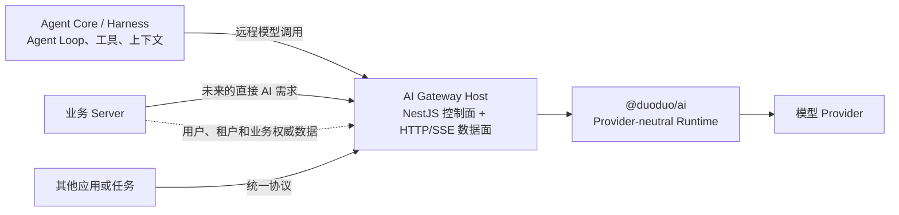

# AI Gateway Host 拆分收益与启用判据

- 决策状态：保留方向，尚未授权实施
- 目标读者：负责 AI Runtime、Agent、业务 Server 与平台基础设施的工程师
- 阅读后的行动：能够判断是否应把进程内 AI Runtime 拆成独立 Gateway Host，并明确拆分后各模块的职责

## 结论

把 AI 能力拆成独立 Gateway Host 的核心价值，不是多增加一层 HTTP，也不是把 Agent Core 搬到另一个进程，而是为多个 AI 消费方建立一个统一的治理和运行 seam（可替换接口点）。

这个 seam 可以集中解决凭证托管、租户认证、配额和预算、使用量归因、跨 Provider 路由、统一观测以及独立扩缩容等跨请求、跨应用问题。Provider 协议、认证机制和传输归一化仍由 `@duoduo/ai` Runtime 实现；Agent Loop、工具、上下文和业务工作流仍由 Agent Core / Harness 实现。

当前仓库尚未出现必须立即承担这些分布式系统成本的证据。因此，本方向继续保留，但不创建 Gateway Host。出现第二个远程消费者、凭证集中托管或跨应用治理需求时，再启动协议和迁移设计。

## “拆成 AI Gateway”具体指什么

当前 `@duoduo/ai` 是运行在宿主进程内的 Gateway Runtime。它已经把 Provider 注册、模型协议、认证、传输、重试、会话、流式响应、图像、视频和可恢复任务封装在统一接口之后。

未来的拆分是在 Runtime 外增加一个独立 Gateway Host：

拆分后，Gateway Host 是 `@duoduo/ai` 的宿主和网络入口，不是替代品。它把 Runtime 已有能力变成可被多个进程使用、可统一治理的基础设施能力。

## 当前架构可能遇到的问题

当只有一个 Agent 进程使用模型时，进程内 Runtime 最简单，也最可靠。随着消费者和治理需求增加，下列问题会逐渐出现：

Runtime 库本身无法集中解决这些问题，因为每个宿主进程都会拥有独立的凭证视图、并发状态、预算计数和观测数据。只有把所有消费者收敛到同一个网络入口，跨进程策略才有统一、权威的执行点。

| 问题               | 不拆分时的表现                                                   | 独立 Gateway Host 的处理方式                                             |
| ------------------ | ---------------------------------------------------------------- | ------------------------------------------------------------------------ |
| Provider 接入重复  | 每个应用都要组装 Provider、模型和连接策略，行为容易漂移          | 所有消费者通过同一入口复用同一 Runtime 实现                              |
| 凭证分散           | Provider Key 进入多个应用进程，泄露面和轮换成本随消费者增加      | Gateway 集中保管 Provider 凭证，消费者只持有受限的服务身份或 Virtual Key |
| 配额和预算割裂     | 每个进程只能看见自己的请求，无法实施跨应用硬预算                 | Gateway 在统一入口执行租户配额、并发限制、速率限制和预算门禁             |
| 使用量无法统一归因 | usage、cost 和失败信息散落在各应用日志中                         | Gateway 统一记录调用方、租户、模型、用量、成本和终态                     |
| 路由策略散落       | fallback、区域选择和模型切换进入各业务代码                       | Gateway 集中执行经过批准的路由、健康检查和 fallback policy               |
| 观测口径不一致     | 各调用方分别包装日志、指标和 trace，字段和错误分类不一致         | Gateway 从 Runtime Observer 生成统一的日志、指标、trace 和 SLO           |
| 负载互相影响       | 长视频任务、图片生成和聊天请求争抢同一宿主资源                   | Gateway 按工作负载设置 Bulkhead，并独立扩缩容                            |
| 发布和故障耦合     | 更新 Agent 工作流可能影响模型接入，Provider 变更也要求发布调用方 | Gateway 和业务消费者可以独立发布，并隔离部分故障域                       |

Gateway 负责的是基础设施级路由，例如端点健康、区域、凭证池和经过批准的 Provider fallback；Agent 仍负责根据任务质量、工作流阶段和业务语义选择模型。两者不能合并成一套不可解释的隐式路由。

## 可以获得的主要收益

### 1. 降低安全暴露面

Provider 凭证只进入 Gateway 的受控运行环境。Agent、业务 Server 和未来消费者使用项目内部身份，不直接接触上游密钥。密钥轮换、吊销、作用域限制和访问审计因此集中在一处。

这里集中的是凭证托管和访问决策。具体 Provider 的签名、OAuth 刷新、认证头保护和凭证作用域仍属于 `@duoduo/ai` Runtime，Gateway Host 不应复制这些实现。

### 2. 建立统一的成本和租户治理

所有模型调用经过同一入口后，系统才能可靠回答：谁在调用、为哪个租户调用、使用了哪个模型、花了多少、是否接近预算。Gateway 可以在请求发出前实施限流和硬预算，在请求结束后记录实际 usage 和 cost。

这解决的是跨请求、跨应用的治理问题。单次调用的 token、媒体时长、Provider 账单字段和标准化错误仍由 Runtime 产出。

### 3. 提高 Provider 能力的复用和一致性

Provider 差异被留在一个深模块中，调用方只学习稳定的 Gateway 接口。新增 Provider、修复协议兼容问题、调整安全重试或处理上游变更时，可以在一个位置修复，所有消费者同时受益。

这种 locality 是拆分最直接的工程收益：如果删除 Gateway，认证、治理、路由和观测复杂度会重新散落到每个消费者，说明这个模块确实在承担复杂度，而不是简单转发。

### 4. 获得统一的可靠性控制点

Gateway 可以在全局视角实施并发隔离、排队上限、Circuit Breaker、健康路由和受控 fallback。单个 Agent 进程无法准确看见其他消费者对同一 Provider 或凭证池造成的压力。

统一控制点也使取消、超时、重试、幂等性和流式终态能够使用同一套语义，减少调用方各自补丁造成的重复执行和状态不一致。

### 5. 支持独立扩缩容和故障隔离

Agent 的资源曲线取决于 Agent Loop、工具执行和上下文处理；Gateway 的资源曲线取决于连接数、流式响应、媒体轮询和 Provider 并发。拆分后可以分别设置副本数、资源限制、发布节奏和故障恢复策略。

这种隔离不会自动消除故障，但能避免业务 Server、Agent 工作流和 AI 接入层必须作为一个部署单元共同扩容或回滚。

### 6. 为多个消费者提供稳定入口

业务 Server、离线任务、运营工具或未来应用可以复用同一 AI 能力，而不需要依赖 Agent 的内部代码。Agent 仍然可以组合模型调用、工具和工作流，但不再是其他应用使用基础模型能力的必经宿主。

## 它不解决什么

独立 Gateway Host 不会自动解决以下问题：

- Agent Loop 是否正确、何时停止以及如何恢复；
- 提示词质量、上下文压缩、记忆、RAG 和工具选择；
- 工具执行的权限、安全性、幂等性和业务补偿；
- 剧本、角色、分镜等领域输出是否符合产品语义；
- Provider 本身的模型质量、限流、区域故障或能力缺失；
- `@duoduo/ai` 尚缺的 Structured Output、Runtime 观测和真实 Provider 验收。

这些问题分别属于 Agent Core / Harness、业务模块或 Runtime。把它们一起放入 Gateway 会扩大接口、降低模块深度，并形成一个难以演进的中央系统。

## 拆分带来的成本和新风险

Gateway 是一次分布式系统化，收益必须覆盖以下代价：

| 成本或风险     | 具体影响                                     | 启用前必须具备的控制                                               |
| -------------- | -------------------------------------------- | ------------------------------------------------------------------ |
| 新增网络跳数   | 增加连接、序列化和首 token 延迟              | 明确延迟预算，保持流式透传，避免不必要的消息转换                   |
| 新的单点故障   | Gateway 不可用会影响全部 AI 消费方           | 多副本、健康检查、优雅关闭、限时重试和容量预案                     |
| 流式语义更复杂 | 客户端断开、背压、取消和终态可能跨越多个连接 | 明确 SSE/WebSocket 生命周期、取消传播和 exactly-one terminal event |
| 契约演进成本   | Host 与客户端可能独立发布，类型不再天然同步  | 版本化协议、兼容策略、契约测试和废弃窗口                           |
| 计量一致性问题 | 重试、断线和重复请求可能造成重复记账         | 请求幂等键、权威 usage 来源、追加式审计和对账策略                  |
| 凭证集中风险   | Gateway 成为更高价值的攻击目标               | 最小权限、密钥隔离、日志脱敏、网络策略和完整审计                   |
| 运维负担       | 增加部署、告警、值班、容量和数据存储责任     | 明确所有者、SLO、运行手册和故障演练                                |

如果没有真实的跨应用治理需求，这些成本通常高于独立部署带来的收益。

## 何时应该启动拆分

出现以下任一信号时，应重新进入 Gateway Host 设计，而不是直接开始编码：

- 出现第二个需要远程共享 AI Runtime 的真实消费者；
- Provider 凭证必须从 Agent 或业务进程集中迁出；
- 需要跨应用的 Virtual Key、租户配额、预算或成本归因；
- 需要中心化的跨 Provider 路由、fallback 或健康治理；
- Agent 与 AI 接入层需要不同的扩缩容、发布节奏或故障域；
- 监管或审计要求所有模型调用经过统一策略执行点。

仅出现“以后可能会有多个消费者”或“微服务看起来更规范”，不足以启动拆分。一个真实消费者、没有中心治理需求时，继续使用进程内 Runtime 能获得更低延迟、更少故障点和更简单的调试体验。

## 推荐的职责分配

| 模块                 | 应负责                                                                                            | 不应负责                                        |
| -------------------- | ------------------------------------------------------------------------------------------------- | ----------------------------------------------- |
| `@duoduo/ai` Runtime | Provider adapter、模型协议、认证机制、Transport、单请求和 Runtime 级可靠性、标准事件与 usage/cost | HTTP 入站、租户数据库、业务模型选择、Agent Loop |
| AI Gateway Host      | 服务认证、Virtual Key、配额、预算、用量持久化、审计、跨 Provider 策略、网络协议和独立运维         | 重写 Provider 协议、执行工具、管理 Agent 上下文 |
| Agent Core / Harness | Agent Loop、工具、上下文、会话树、工作流、应用级模型选择与业务 fallback                           | Provider 线协议、认证头、底层传输重试           |
| 业务 Server          | 用户、组织、权限、订单和其他权威业务数据                                                          | Provider 接入、Agent Loop、模型流解析           |

Gateway 可以消费业务 Server 提供的可信租户身份或授权事实，但不复制用户和业务数据的权威所有权。

## 80/20 的首个 Gateway 切片

如果启用条件成立，第一阶段只应打通一条可运营的竖切：

1. 先确定外部协议、身份传递、错误语义、取消语义和 SLO；
2. Gateway Host 组合现有 `@duoduo/ai` Runtime，不复制 Provider adapter；
3. 支持一个生产文本流协议和一个真实消费者；
4. 加入服务认证、请求级租户上下文、基础限流与预算门禁；
5. 持久化 request、usage、cost、终态和脱敏审计事件；
6. 通过契约测试、断连取消测试和受控 Provider smoke test；
7. 验证收益后，再扩展图片、视频、复杂路由、多区域和管理能力。

首个切片不应同时实现管理后台、语义缓存、LLM Router、完整账单系统或所有 38 个 Provider 的远程验收。这些能力应由实际负载和治理需求逐项触发。

## 当前保留决定

未来 Gateway Host 采用独立 NestJS 应用作为保留方向；`@duoduo/ai` 继续保持纯 TypeScript、框架无关。外部协议仍未选择，项目原生协议、OpenAI-compatible 协议和双协议方案必须在启用时重新评审。

当前不创建应用、依赖、路由、远程 Adapter 或共享 contracts，也不修改 Agent 的生产调用链。Runtime 的近期优先级仍是完成现有 [AI Gateway Runtime 差距基线](./reviews/2026-07-28-ai-gateway-runtime-gap-analysis.md) 中的生产闭环。
